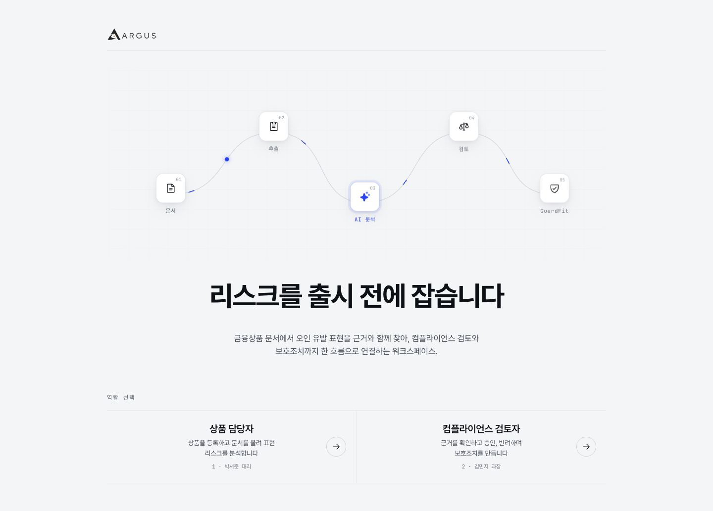
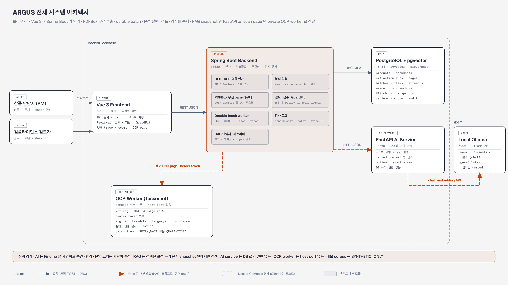
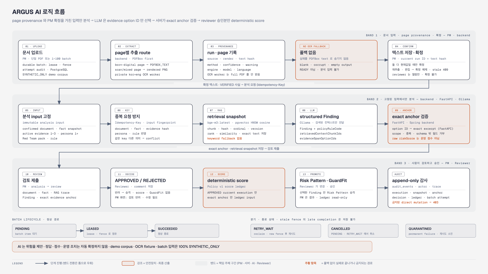
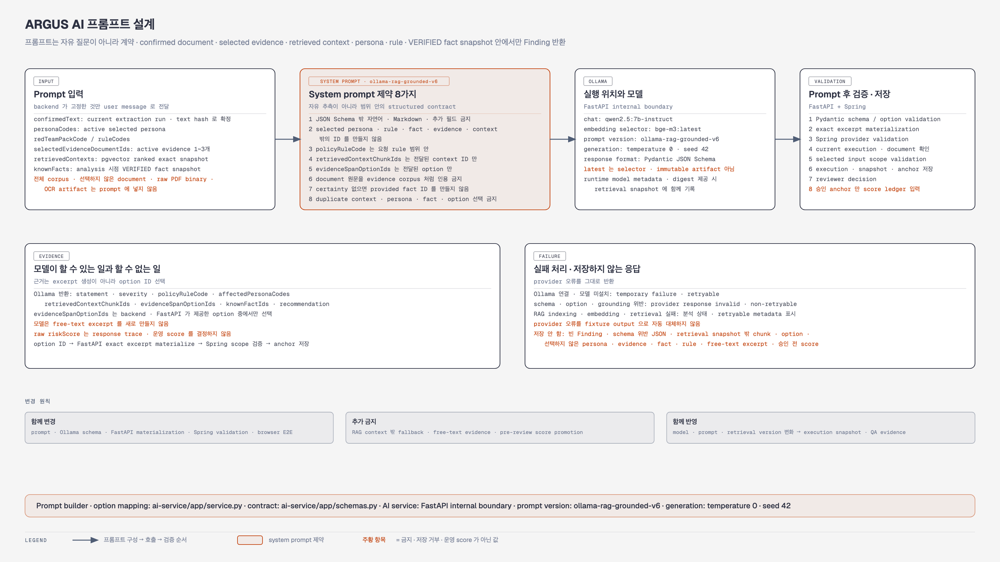
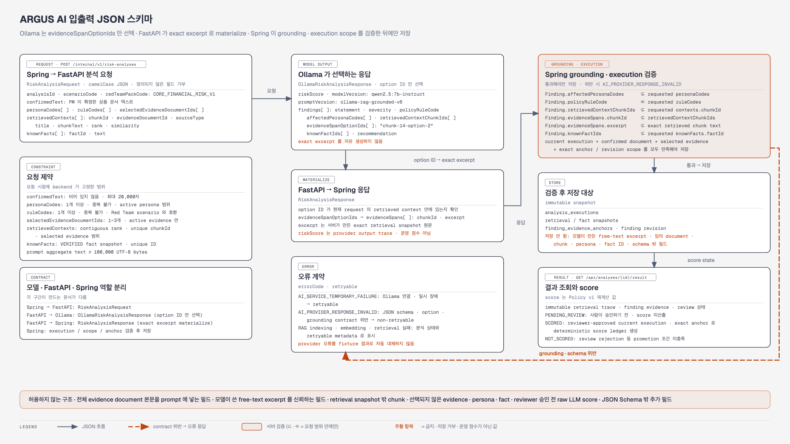
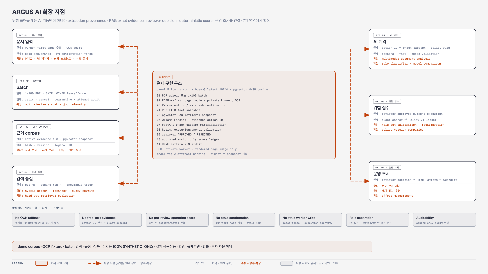
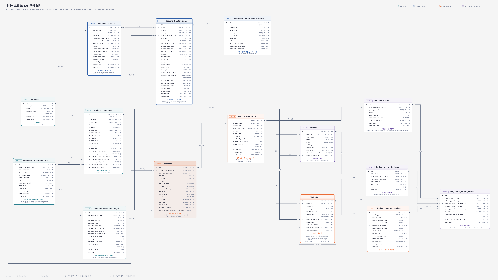
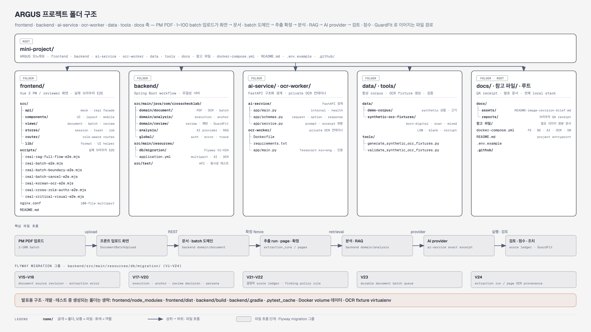
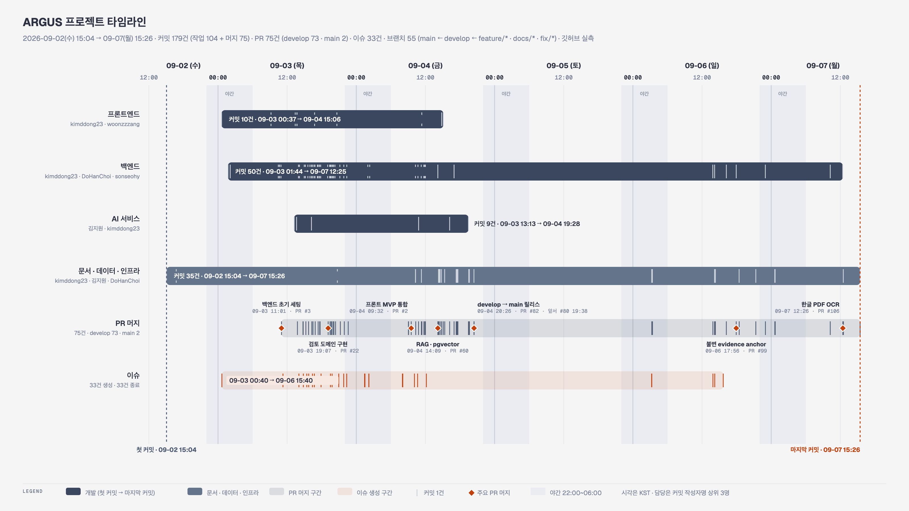

# ARGUS

## 금융상품 판매 리스크 사전검증 AI 플랫폼



- 판매 문서의 위험 표현을 분석하고, 근거·검토·보호조치 이력을 연결하는 로컬 AI 컴플라이언스 데모
- 대상 흐름: 상품 담당자(PM) → 컴플라이언스 reviewer → Risk Pattern → GuardFit 적용 가이드
- 구성: Vue 3 SPA, Spring Boot, FastAPI AI service, PostgreSQL + pgvector, Ollama
- 아키텍처 성격: 단일 업무 backend와 독립 AI service를 Docker Compose로 실행하는 로컬 시스템
- MSA, 원격 운영 서비스, 실제 금융·법률 자문 서비스가 아님

## 프로젝트 개요

### 해결하려는 문제

- 판매 자료의 수익·안정성 표현이 손실 가능성·비용·유동성 제약보다 먼저 강조되는 문제
- AI 분석 결과가 어떤 문서 근거에서 나왔는지 추적하기 어려운 문제
- 담당자의 분석 요청과 검토자의 승인·반려가 분리돼 이력 관리가 어려운 문제
- 승인된 개선 조치를 다시 판매 화면에 적용하는 단계가 단절되는 문제

### ARGUS의 처리 방식

- PM이 PDF를 업로드하고 추출 텍스트를 직접 확정
- VERIFIED 공식 사실, Persona, Red Team rule, 활성 근거 문서를 명시적으로 선택
- pgvector가 선택된 근거 범위에서만 context를 검색
- Ollama가 구조화된 Finding과 exact evidence span을 반환
- backend가 검색 chunk·Persona·공식 사실 범위를 검증
- reviewer 승인 Finding만 Risk Pattern으로 승격
- reviewer 승인 GuardFit만 PM 적용 가이드에 노출

### 범위와 데이터 고지

- `data/demo-corpus/`, `data/demo-showcase-pdfs/`의 모든 상품명·PDF·정책·규정·수치는 100% 합성 데이터
- 실제 금융상품·회사·고객·규제기관·법령을 의미하지 않음
- 실제 투자 판단, 법률 판단, 금융 판매 자료로 사용 금지
- 개인정보, 상용 인증, 원격 배포, 운영 모델 라이선스 관리는 구현 범위 밖
- 이미지형 스캔 PDF OCR은 현재 실제 서버에서 지원하지 않음
- 실제 서버 PDF 추출은 PDFBox text layer 기준

## 이해관계자와 제공 가치

### 상품 담당자 PM

- 기존 문제: 문서·위험·검토 요청을 수작업으로 연결
- ARGUS 역할: 상품 등록, 문서 확정, 사실 검증, Persona + Red Team 분석, 검토 요청

### 컴플라이언스 reviewer

- 기존 문제: AI 결과의 근거·우선순위·승인 이력이 불명확
- ARGUS 역할: RAG trace 확인, Finding 승인·반려, Risk Pattern·GuardFit 결정

### 운영 담당자

- 기존 문제: 개선 조치가 판매 화면에 반영되는지 추적 어려움
- ARGUS 역할: 승인 GuardFit 적용 가이드 확인

## 핵심 기능

- 실제 PDF 업로드와 PDFBox text extraction
- 문서 확정 후 VERIFIED 공식 사실 관리
- Persona 1~4개, 근거 문서 1~3개, Red Team Pack 기반 분석
- pgvector cosine retrieval, Ollama `bge-m3:latest` embedding, `qwen2.5:7b-instruct` 분석
- exact evidence span과 chunk ID 기반 RAG provenance
- PM → reviewer 검토 요청, 승인·반려 흐름
- 승인 Finding → Risk Pattern → 승인 GuardFit 흐름
- Idempotency-Key, execution token, terminal audit event
- 분석 중 원문 변경 차단, stale RUNNING 분석 자동 복구
- 실제 API 모드와 Mock UX 모드의 명확한 분리

## 전체 서비스 흐름

```text
PM
상품 등록
→ PDF 업로드
→ PDFBox 텍스트 추출
→ 텍스트 확정
→ VERIFIED 공식 사실 확인
→ Persona + Red Team 분석
→ Finding·RAG trace 확인
→ reviewer 검토 요청

reviewer
검토함 확인
→ 원문·공식 사실·Finding·RAG trace 확인
→ 승인 또는 반려

승인
선택 Finding만 Risk Pattern 생성
→ Pattern 활성화
→ GuardFit 초안 생성
→ GuardFit 승인
→ PM 적용 가이드 노출

반려
반려 comment 기록
→ Pattern·GuardFit 생성 없음
→ PM 수정 필요 상태 확인
```

- review 승인: 선택한 Finding만 Pattern으로 승격
- review 반려: comment 필수, Risk Pattern·GuardFit 미생성
- 기존 Pattern: 새 Pattern 생성 시 삭제하지 않고 library에 보존
- 분석 원문: 분석이 생성되면 수정·확정 해제 불가
- 비정상 종료 분석: stale `RUNNING` 상태를 주기적으로 `FAILED`로 전환, 기존 retry 경로 사용

## 시스템 아키텍처



- Frontend
  - Vue 3, Vite, Vue Router, Pinia
  - PM·reviewer 역할별 화면과 route guard
- Backend
  - Spring Boot
  - 상품·문서·분석·검토·Risk Pattern·GuardFit·감사 workflow
  - PDFBox extraction, pgvector retrieval, terminal audit transaction
- Database
  - PostgreSQL 16 + pgvector
  - Flyway migration
  - retrieval run·snapshot·audit event 보관
- AI service
  - FastAPI
  - Ollama chat·embedding 호출
  - backend 전용 bearer token 검증
- Ollama
  - `bge-m3:latest`: 1024차원 embedding
  - `qwen2.5:7b-instruct`: structured risk analysis

## RAG와 AI 분석 설계

### 분석 입력

- 확정된 판매 문서 텍스트
- 활성 근거 문서 1~3개
- VERIFIED 공식 사실 snapshot
- Persona 1~4개
- 활성 Red Team rule

### 검색·분석 순서

```text
선택 근거 문서 chunking
→ embedding model digest 확인
→ pgvector cosine top-6 retrieval
→ 검색 chunk만 AI service에 전달
→ Ollama structured JSON 응답
→ chunk ID·exact evidence span·Persona·fact 범위 검증
→ immutable retrieval snapshot·Finding·audit 저장
```



### 근거 검증 원칙

- 전체 evidence 문서를 prompt에 넣지 않음
- lexical 또는 full-document fallback 없음
- 모델은 `retrievedContextChunkIds`와 `evidenceSpans`를 함께 반환
- `evidenceSpans.excerpt`는 선택된 retrieved chunk 원문에 정확히 포함돼야 함
- 선택하지 않은 Persona, 근거 문서, 공식 사실 ID는 결과 저장 거부
- AI 내부 분석 endpoint는 shared bearer token 없이는 401 거부
- embedding tag는 Ollama digest가 포함된 immutable model identity로 저장·검색
- zero-norm vector 저장·검색 거부







## Persona와 Red Team Pack

### Persona

- 금융 초보자: 확정수익·원금보장 오해
- 고령 금융소비자: 안정성 표현·인지 접근성
- 손실 경험자: 손실 범위·위험 민감도
- 단기 자금 필요: 중도해지 비용·유동성 제약
- 자영업자: 금리 변동·납부 조건·현금흐름

- 분석 요청에서는 최대 4개를 선택
- 선택하지 않은 Persona를 AI 결과에 넣으면 provider contract 위반

### 기본 Red Team Pack

- 수익 강조 편향
- 손실 완화 표현
- 비용 누락
- 안정·보장 키워드
- 형식적 확인
- 인지 접근성

## 데이터 모델

- 핵심 도메인: users, products, product_documents, analyses, reviews, findings, risk_patterns, guardfit_actions, audit_events
- RAG 도메인: evidence_documents, evidence_document_chunks, analysis_rag_runs, analysis_rag_retrieval_snapshots
- 분석 terminal state와 terminal audit event: 같은 transaction으로 저장
- retrieval snapshot: 완료 analysis 기준 변경 불가, retry 중에는 새 retrieval run으로 교체




## 기술 스택

- Frontend: Vue 3, Vite, Vue Router, Pinia, Playwright Core
- Backend: Java 21, Spring Boot, Spring Data JPA, Flyway
- Database: PostgreSQL 16, pgvector, HNSW cosine index
- AI: FastAPI, Pydantic, Ollama, bge-m3, qwen2.5
- Document: PDFBox, PDF.js, Tesseract.js UI experiment
- Runtime: Docker Compose, Nginx
- Test: JUnit, MockMvc, pytest, Playwright E2E

## 저장소 구조

```text
mini-project/
├── frontend/                     # Vue 3 SPA
│   ├── src/api/                  # actual/mock adapter
│   ├── src/views/                # PM·reviewer 화면
│   ├── src/stores/               # session·toast·async job 상태
│   └── scripts/                  # smoke·real RAG E2E
├── backend/                      # Spring Boot workflow API
│   ├── src/main/java/            # domain·application·RAG·provider
│   ├── src/main/resources/db/    # Flyway migration
│   └── src/test/                 # API·workflow·RAG 회귀 테스트
├── ai-service/                   # FastAPI internal AI service
│   ├── app/                      # schema·prompt·provider validation
│   ├── fixtures/                 # Mock provider contract fixture
│   └── tests/                    # pytest
├── data/
│   ├── demo-corpus/              # canonical synthetic RAG corpus
│   └── demo-showcase-pdfs/       # 실제 업로드 시연 PDF
├── docs/assets/                  # README 다이어그램
├── docker-compose.yml            # local runtime
└── README.md
```



## 로컬 실행

### 사전 조건

- Docker Desktop
- Ollama
- 충분한 로컬 디스크·메모리

```bash
ollama serve
ollama pull bge-m3:latest
ollama pull qwen2.5:7b-instruct
ollama list
```

### 환경 설정

```bash
cp .env.example .env
```

주요 기본값:

```dotenv
DB_PORT=5432
BACKEND_PORT=8080
AI_SERVICE_PORT=8000
FRONTEND_PORT=5173
AI_PROVIDER=ollama
OLLAMA_BASE_URL=http://host.docker.internal:11434
OLLAMA_MODEL=qwen2.5:7b-instruct
OLLAMA_EMBEDDING_MODEL=bge-m3:latest
AI_SERVICE_INTERNAL_TOKEN=crosschecklab-local-internal-token
```

- `AI_SERVICE_INTERNAL_TOKEN`: 로컬 합성 기본값
- 실제 운영 환경: 별도 secret으로 교체 필요
- Compose container: host Ollama에 연결
- 서비스: `restart: unless-stopped`

### 실행

```bash
docker compose up --build -d
docker compose ps
```

접속 주소:

- Frontend: http://localhost:5173
- Swagger: http://localhost:8080/swagger-ui/index.html
- Backend health: http://localhost:8080/actuator/health
- AI health: http://localhost:8000/internal/v1/health

```bash
curl -fsS http://localhost:8080/actuator/health
curl -fsS http://localhost:8000/internal/v1/health
```

- AI health `provider: ollama` 확인 필요
- health 응답: 의존성 도달성만 확인
- 실제 RAG·Ollama 분석 성공: 아래 real E2E 또는 PM workflow로 별도 확인

## 시연 데이터

### 시연용 판매 PDF

- `01-프라임인컴-판매자료-위험표현.pdf`
- `02-그린밸런스-중도해지-안내.pdf`
- `03-클리어세이프-균형설명서.pdf`
- `04-스테이블리턴-표현검토-시연.pdf`
- `05-라이프캐시-유동성안내-시연.pdf`

경로: `data/demo-showcase-pdfs/`

### RAG canonical corpus

- 상품 입력: `data/demo-corpus/documents/product/SMART-INCOME-SALES-v1.pdf`
- 근거 PDF: `data/demo-corpus/documents/evidence/`
- corpus hash·logical ID: `data/demo-corpus/manifest.v1.json`
- expected RAG case: `data/demo-corpus/expected/`

## 검증

### Backend

```bash
cd backend
./gradlew cleanTest test
```

- API·workflow·RAG·audit·migration 회귀 검증

### AI service

```bash
cd ai-service
python -m pytest -q
```

- Pydantic schema·AI bearer token·prompt·provider contract 검증

### Frontend

```bash
cd frontend
npm run build
VITE_USE_MOCK=false npm run build
```

- Mock mode build·actual API mode build 검증

### 실제 RAG E2E

```bash
PLAYWRIGHT_EXECUTABLE_PATH="/absolute/path/to/Chromium" \
node frontend/scripts/real-rag-full-flow-e2e.mjs
```

- 실제 PDF upload
- PDFBox extraction
- official fact verification
- pgvector retrieval
- Ollama analysis
- PM review request
- reviewer approval
- Risk Pattern
- GuardFit

- API interception·`mockServer` 사용 없음
- page error·request failure·예상 밖 4xx/5xx는 실패 처리

## 운영·문제 해결

```bash
docker compose ps
docker compose logs -f backend ai-service
docker compose logs -f postgres
ollama list
```

- AI health 실패: Ollama daemon·`OLLAMA_BASE_URL`·모델 설치 확인
- 분석 실패: 결과 화면 error code·retryable 상태와 backend/AI log 확인
- 모델 미설치: `ollama pull bge-m3:latest`, `ollama pull qwen2.5:7b-instruct`
- 포트 충돌: `.env`의 port 변수 변경
- 기존 Vite dev server가 IPv6 `localhost:5173`을 점유하면 Docker frontend와 다른 화면이 보일 수 있음
  - 확인: `lsof -nP -iTCP:5173 -sTCP:LISTEN`
  - 해결: 이전 Vite process 종료 후 Docker frontend 재접속

### 데이터 초기화

```bash
docker compose down      # container 종료, DB 유지
docker compose down -v   # DB·RAG index·분석·검토·감사 데이터 삭제
docker compose up --build -d
```

- `down -v`: 시연 데이터까지 삭제
- source hash·chunking version·embedding model digest가 같으면 기존 index 재사용
- tag digest가 달라지면 새 vector index generation 생성

## 팀 구성

- 김지원: PM, API 설계
- 최도한: Backend, Data Architecture
- 손서현: Backend, DevOps
- 신주용: Frontend, UI/UX
- 정다운: Frontend, UI/UX

## 개발 타임라인



## 상세 문서

- Backend·DB·RAG: `backend/README.md`
- Frontend·실서버 UI: `frontend/README.md`
- corpus·hash·제한: `data/demo-corpus/README.md`
