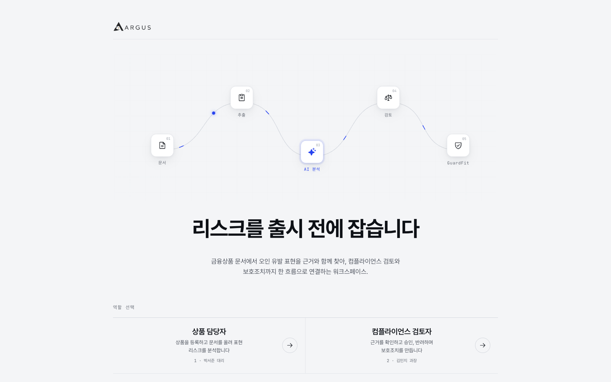
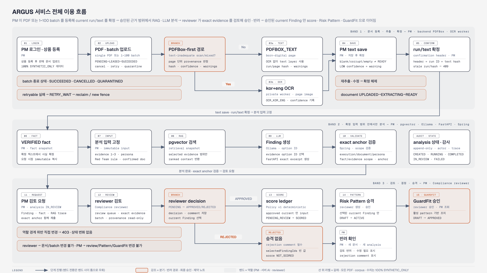
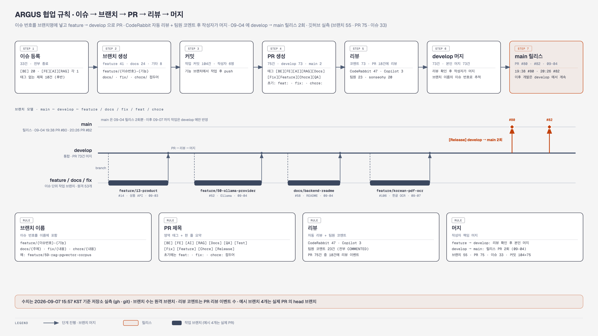
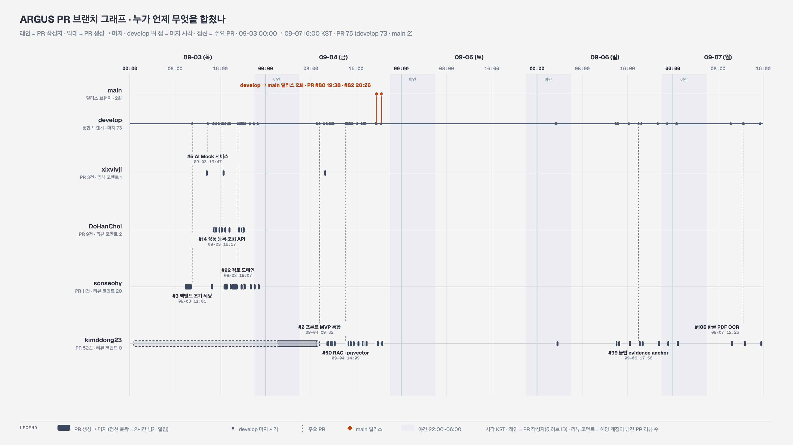

# ARGUS

## 금융상품 판매 리스크 사전검증 AI 플랫폼



- 판매 문서의 위험 표현을 분석하고, 근거·검토·보호조치 이력을 연결하는 로컬 AI 컴플라이언스 데모
- 업무 흐름: 상품 담당자(PM) 분석 → 컴플라이언스 reviewer 검토 → Risk Pattern → GuardFit 적용 가이드
- 구성: Vue 3 SPA, Spring Boot backend, FastAPI AI service, PostgreSQL + pgvector, Ollama
- 실행 형태: 단일 업무 backend와 독립 AI service를 Docker Compose로 구동
- MSA, 원격 운영 서비스, 실제 금융·법률 자문 서비스가 아님

## 요약

### 해결하는 문제

- 판매 자료에서 수익·안정성 표현이 손실 가능성·비용·유동성 제약보다 강조되는 문제
- AI 결과의 문서 근거와 담당자·검토자 승인 이력을 추적하기 어려운 문제
- 승인된 개선 조치가 판매 화면의 적용 가이드까지 이어지지 않는 문제

### 핵심 흐름



```text
PM
상품 등록 → PDF 업로드·텍스트 확정 → 공식 사실 확인
→ Persona·Red Team 분석 → Finding·RAG trace 확인 → 검토 요청

reviewer
원문·공식 사실·Finding·RAG trace 확인 → 승인 또는 반려

승인
선택 Finding → Risk Pattern → GuardFit 승인 → PM 적용 가이드

반려
comment 기록 → Pattern·GuardFit 미생성 → PM 수정 필요 상태
```

- reviewer가 승인한 Finding만 Risk Pattern으로 승격
- reviewer가 승인한 GuardFit만 PM 적용 가이드에 노출
- 반려 시 comment가 필수이며 Risk Pattern과 GuardFit은 생성하지 않음
- 분석이 생성된 원문은 수정하거나 확정을 해제할 수 없음

## 범위와 데이터 고지

- `data/demo-corpus/`, `data/demo-showcase-pdfs/`의 상품명·PDF·정책·규정·수치는 100% 합성 데이터
- 실제 금융상품·회사·고객·규제기관·법령을 의미하지 않음
- 실제 투자 판단, 법률 판단, 금융 판매 자료로 사용 금지
- 개인정보, 상용 인증, 원격 배포, 운영 모델 라이선스 관리는 구현 범위 밖
- PDF는 page별로 PDFBox text layer를 먼저 사용하고, text-inadequate scan/mixed page만 `kor+eng` OCR worker로 전달

## 시스템 아키텍처


- Frontend: Vue 3, Vite, Vue Router, Pinia 기반 PM·reviewer 화면과 route guard
- Backend: Java 21, Spring Boot, PDFBox/OCR 기반 업무 workflow·RAG·감사 처리
- Database: PostgreSQL 16, pgvector, Flyway, HNSW cosine index
- AI service: FastAPI, Pydantic, backend 전용 bearer token 검증
- Local AI: Ollama `bge-m3:latest` embedding, `qwen2.5:7b-instruct` 분석
- Runtime: Docker Compose, Nginx

```text
Frontend
  → Backend
      ├─ PostgreSQL + pgvector
      ├─ PDFBox page router → OCR worker (kor+eng, private network)
      └─ AI service → Ollama
```

### 로컬 모델 선택 근거

- **분석 — [Qwen2.5 7B Instruct](https://huggingface.co/Qwen/Qwen2.5-7B-Instruct)**: 한국어·구조화 JSON 응답 지원. ARGUS의 Finding·근거 ID 응답 계약과 local Ollama 개발·데모 크기에 맞춰 기준선으로 선택.
- **검색 — [BGE-M3](https://huggingface.co/BAAI/bge-m3)**: 한국어·영문 혼합 문서 검색과 현재 pgvector `vector(1024)` schema에 맞는 1024차원 embedding 모델.
- **DeepSeek를 쓰지 않은 이유**: 보안 이슈가 아닌 계약 차이. DeepSeek-R1 8B의 reasoning 출력·권장 prompt 방식은 현재의 짧은 JSON 응답 계약과 달라, 품질·응답시간 비교 전에는 교체하지 않음.
- Qwen 14B·DeepSeek 8B는 동일 synthetic test set에서 한국어 Finding 정확도·근거 인용·응답시간을 비교한 뒤 필요할 때 교체.

### 설계 이미지

이미지 재생성 시에는 [`docs/assets/README-image-revision-brief.md`](docs/assets/README-image-revision-brief.md)를 사실 기준으로 사용한다.


## RAG 근거 추적 계약

```text
확정 판매 문서 + VERIFIED 공식 사실 snapshot
+ Persona 1개 이상 + 활성 근거 문서 1~3개 + Red Team rule
→ 근거 문서 chunking
→ pgvector cosine top-6 검색
→ Finding + policy rule + evidence option ID 반환
→ backend 검증
→ retrieval snapshot·Finding·audit 저장
```


- 전체 근거 문서를 prompt에 넣지 않으며 lexical·full-document fallback을 사용하지 않음
- 모델은 `retrievedContextChunkIds`와 허용된 `evidenceSpanOptionIds`만 반환
- backend가 option ID를 exact retrieved chunk excerpt로 매핑·검증하며, 모델이 excerpt를 직접 만들 수 없음
- 선택하지 않은 Persona·근거 문서·공식 사실 ID가 포함되면 저장을 거부
- retrieval snapshot에는 configured model ID와 runtime이 제공한 embedding digest를 함께 기록한다. `latest` tag만으로 artifact pinning을 주장하지 않음
- 완료된 retrieval snapshot은 변경 불가
- 분석 terminal state와 terminal audit event는 같은 transaction으로 저장
- AI 내부 분석 endpoint는 shared bearer token이 없으면 401 응답


## PDF 한글 OCR·확정 계약

- born-digital page는 `PDFBOX_TEXT`, scan/mixed page는 `OCR_KOR_ENG`으로 page별 선택 text를 저장
- OCR page는 render artifact hash, text hash, confidence, engine·tessdata·language provenance를 run/page 단위로 보관
- OCR confidence는 검토 신호일 뿐 정확성 또는 확정 상태가 아님
- PM은 현재 extraction run ID와 text hash가 일치할 때만 저장·확정할 수 있다. 새 run·text edit은 이전 확정을 해제한다.
- reviewer는 page provenance를 읽을 수 있지만 수정·재시도·확정할 수 없다.
- OCR은 PDF 범위만 지원한다. synthetic born-digital·image-only·mixed fixture의 actual browser E2E로 검증한다.

## 주요 기능

- PDF 업로드, PDFBox text extraction, 사용자 텍스트 확정
- VERIFIED 공식 사실 관리
- Persona·Red Team Pack 기반 구조화 분석
- exact evidence span·chunk ID 기반 RAG provenance
- PM → reviewer 승인·반려 workflow
- 승인 Finding → Risk Pattern → 승인 GuardFit workflow
- Idempotency-Key, execution token, terminal audit event
- stale `RUNNING` 분석의 `FAILED` 전환과 retry 경로
- 실제 API 모드와 Mock UX 모드 분리

## 로컬 실행

### 사전 조건

- Docker Desktop
- Ollama
- 로컬 모델을 저장·실행할 수 있는 디스크와 메모리

### 1. 모델 준비

```bash
ollama serve
ollama pull bge-m3:latest
ollama pull qwen2.5:7b-instruct
ollama list
```

### 2. 환경 설정과 서비스 실행

프로젝트 루트에서 실행:

```bash
cp .env.example .env
docker compose up --build -d
docker compose ps
```

- Compose container는 기본적으로 `http://host.docker.internal:11434`의 host Ollama에 연결
- `.env.example`의 `AI_SERVICE_INTERNAL_TOKEN`은 로컬 합성 기본값이며 운영 secret이 아님
- 메모리 상한: backend 2g(heap 60%)·ai-service 512m·ocr-worker 768m. 모델 context는 `OLLAMA_NUM_CTX`(기본 32768, KV cache 약 1.9GB), 모델 상주 시간은 `OLLAMA_KEEP_ALIVE`로 조정. 다른 작업과 같이 돌릴 때는 `OLLAMA_NUM_CTX=8192`, `OLLAMA_KEEP_ALIVE=1m`

### 3. 접속과 상태 확인

- Frontend: http://localhost:5173
- Swagger: http://localhost:8080/swagger-ui/index.html
- Backend health: http://localhost:8080/actuator/health
- AI health: http://localhost:8000/internal/v1/health

```bash
curl -fsS http://localhost:8080/actuator/health
curl -fsS http://localhost:8000/internal/v1/health
```

- AI health에서 `provider: ollama` 확인
- health 응답은 의존성 도달성만 확인하며 실제 RAG 분석 성공은 아래 E2E로 검증

## 검증 명령

### Backend

```bash
cd backend
./gradlew cleanTest test
```

- API·workflow·RAG·audit·migration 회귀 검증

### AI service

```bash
cd ai-service
python -m pytest -q
```

- schema·bearer token·prompt·provider contract 검증

### Frontend

```bash
cd frontend
npm run build
VITE_USE_MOCK=false npm run build
```

- Mock mode와 실제 API mode build 검증

### 실제 RAG E2E

프로젝트 루트에서 실행:

```bash
PLAYWRIGHT_EXECUTABLE_PATH="/absolute/path/to/Chromium" \
node frontend/scripts/real-rag-full-flow-e2e.mjs
```

- 실제 PDF upload → PDFBox extraction → official fact verification → pgvector retrieval → Ollama analysis 검증
- PM 검토 요청 → reviewer 승인 → Risk Pattern → GuardFit 전체 흐름 검증
- PM 확정 텍스트 수정·원문 불변성, 분석 후 수정 `409` 차단, reviewer read-only, malformed PDF 실패 화면·오류 metadata 검증
- API interception과 `mockServer`를 사용하지 않음
- page error, request failure, 예상 밖 4xx/5xx 응답은 실패 처리
- 상세 coverage와 미지원 범위: [`docs/reports/real-browser-e2e-coverage.md`](docs/reports/real-browser-e2e-coverage.md)

### 합성 corpus·fixture 도구

```bash
python3 -m venv .venv && .venv/bin/pip install -r tools/requirements.txt
.venv/bin/python tools/validate_synthetic_financial_corpus.py
.venv/bin/python tools/validate_synthetic_ocr_fixtures.py
.venv/bin/python tools/generate_erd_dbml.py --check
```

- 합성 금융 문서 corpus 30종·OCR fixture 6종의 SHA-256·page 수·text layer 기대값 검증
- ERD DBML이 실행 schema DDL과 같은지 확인

## 제출 산출물

- 전체 목록: [`docs/deliverables/`](docs/deliverables/)
- 최종 발표·Use-Case: 발표 슬라이드와 PM·reviewer 업무 흐름
- 설계: 실제 화면 기반 Wireframe, ERD·DB schema, API·Postman Mock, AI prompt·JSON 규격
- 구현: FE·BE scaffolding, 메인·핵심 UI 구현 증빙
- 검증·형상관리: 실제 RAG E2E·회귀 테스트 결과와 GitHub repository 설정

## 시연 데이터

- 판매 PDF: `data/demo-showcase-pdfs/`
- canonical 상품 입력: `data/demo-corpus/documents/product/SMART-INCOME-SALES-v1.pdf`
- 근거 PDF: `data/demo-corpus/documents/evidence/`
- corpus hash·logical ID: `data/demo-corpus/manifest.v1.json`
- expected RAG case: `data/demo-corpus/expected/`
- 다페이지 합성 금융 문서 corpus: [`data/synthetic-financial-corpus/`](data/synthetic-financial-corpus/)
  - 6개 합성 상품군 × 5개 문서 유형, 30개 PDF·102페이지
  - PDFBox 실제 추출·SHA-256·source revision 로컬 검증 완료
  - 향후 batch·PDF OCR의 실제 workload regression으로 사용

## 운영 명령

```bash
docker compose ps
docker compose logs -f backend ai-service
docker compose logs -f postgres
ollama list
```

- AI 연결 실패: Ollama daemon, `OLLAMA_BASE_URL`, 모델 설치 상태 확인
- 포트 충돌: `.env`의 port 변수 변경
- 데이터 유지 종료: `docker compose down`
- DB·RAG index·분석·검토·감사 데이터 삭제: `docker compose down -v`

## 고도화 진행 현황

- 구현 계획: [`docs/plans/ARGUS-위험우선순위-배치-OCR-구현계획.md`](docs/plans/ARGUS-위험우선순위-배치-OCR-구현계획.md)
- 상태 표기: `[완료]` 검증·`develop` 반영 완료 / `[진행 중]` feature branch에서 구현·검증 중 / `[예정]` 설계는 확정됐지만 미구현
- 근거 기반 문서 위험 우선순위·상황 기반 Persona
  - `[완료]` 정책 v1·synthetic TEVV fixture, 불변 source revision, execution-bound Finding, exact evidence anchor, Finding별 reviewer decision 이력
  - `[완료]` 실제 Docker/browser RAG E2E에서 immutable anchor·review decision 저장 확인
  - `[완료]` 결정론 Policy v1 score engine·score ledger·state-first score UI, reviewer 승인 뒤 actual `SCORED` browser E2E
  - `[예정]` held-out TEVV calibration·artifact-pinned model comparison과 score band 재보정
- 대량 파일 자동 처리
  - `[완료]` PostgreSQL durable batch queue, `SKIP LOCKED` lease/fence, item별 retry·cancel·quarantine·attempt audit
  - `[완료]` 1–100 파일 batch upload, cancel·retry·quarantine·CSV error report, PM management·reviewer read-only, actual browser E2E
- PDF 한글 OCR
  - `[완료]` PDFBox-first page routing, isolated `kor+eng` OCR worker, page artifact/hash·confidence·engine provenance
  - `[완료]` PM current run/text-hash confirmation, reviewer read-only, blank·corrupt·LOW confidence·stale confirmation synthetic fixture, actual Compose/browser E2E
- 실서비스 검증·합성 corpus
  - `[완료]` 실제 browser E2E: PM 수정·확정, 분석 후 수정 409, reviewer read-only, malformed PDF 실패 화면, RAG→review→Risk Pattern→GuardFit
  - `[완료]` 실제 browser E2E: PM/reviewer 서버 권한 거부 403, desktop·390px overflow/focus/action visibility
  - `[완료]` 6개 합성 상품군·30개 PDF·102페이지 corpus의 PDFBox extraction·SHA-256·source revision 검증

## 팀 구성

| 이름 | 역할 |
| --- | --- |
| 김지원 | PM, API 설계 |
| 최도한 | Backend, Data Architecture |
| 손서현 | Backend, DevOps |
| 신주용 | Frontend, UI/UX |
| 정다운 | Frontend, UI/UX |

## 개발 타임라인


## 협업 및 형상관리

- 작업 단위: Issue → feature·docs·fix branch → PR → review → `develop` merge
- 릴리스 단위: 검증된 `develop` → release PR → `main` merge
- `main`, `develop` 직접 push 금지
- PR review·자동 리뷰 의견·수정 반영 후 작성자가 merge





## 상세 문서

- Backend·DB·RAG: `backend/README.md`
- Frontend·실서버 UI: `frontend/README.md`
- corpus·hash·제한: `data/demo-corpus/README.md`
