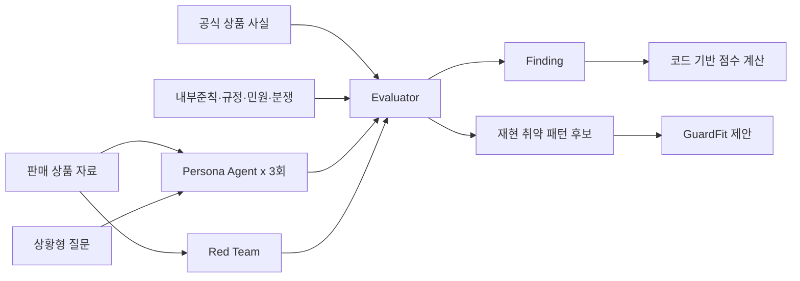

# GuardLab AI 포함 전체 흐름 정합화 및 Frontend QA 지시서

- 문서 버전: V1.0
- 작성일: 2026-09-03
- 대상: Frontend 구현 담당자 및 코드 수정/검수 모델
- 목적: 기능 명세서 v0.2를 기반으로 작성된 현재 프론트를 최신 API/ERD와 AI 포함 전체 업무 흐름에 맞게 정합화한다.

## 0. 이 지시서의 사용 방법

이 문서는 디자인 재작업 지시서가 아니다. 현재 UI의 시각적 품질은 가능한 한 유지하면서, 화면·Mock·API 경계·상태·데이터 관계를 올바른 업무 흐름으로 수정하는 것이 목적이다.

구현 순서는 반드시 다음을 따른다.

1. 이 문서의 용어와 JSON 계약을 먼저 확인한다.
2. 현재 코드와 계약의 차이를 파일 단위로 기록한다.
3. 최소 Golden Scenario Mock 데이터만 만든다.
4. 상품 등록부터 GuardFit 승인본 조회까지 한 번 E2E로 통과시킨다.
5. E2E가 통과한 뒤에만 Mock 상품·Persona·오류 시나리오를 추가한다.
6. 구현을 마친 후 `frontend/docs/reports/v1/implementation-result.md`를 작성한다.

처음부터 대량 Mock 데이터를 만들지 않는다. 현재 코드에 이미 존재하는 대량 시드는 UI 목록 확인 용도로 격리하고, 계약 및 E2E 테스트는 상품 1개짜리 Golden Scenario를 기준으로 수행한다.

## 1. 기준 자료, 확인 위치와 우선순위

참고 자료와 확인 위치는 다음과 같다.

- 기능·API·데이터 명세: 팀에서 공유한 최신 Google Docs 링크를 확인한다. 로컬 복사본보다 Google Docs 원본을 우선한다.
- 최신 API 기준: `GuardLab_MVP_API_명세서_v0.3.1` 이상. `GET /api/products` 추가 여부와 상세 응답 형태를 포함해 확인한다.
- 최신 ERD의 `analyses.input_hash VARCHAR(64)`와 partial unique index: 팀 Slack의 백엔드 페이지에서 확인한다. 이 항목은 Google Docs 복사본만 보고 추정하지 않는다.
- `GuardLab_AI-Ready_JSON_계약서_v1.0.docx`: AI 전체 흐름 참고 초안으로 함께 전달할 수 있으나, 아래 '알려진 정정사항'을 적용해야 한다.
- 현재 프론트 실험 문서: `frontend/docs/ai-provider.md`

### 1.1 AI-Ready JSON 계약서 v1.0 알려진 정정사항

`GuardLab_AI-Ready_JSON_계약서_v1.0.docx`를 최신 API의 단일 기준으로 그대로 사용하지 않는다. 전달 시 반드시 이 지시서를 함께 전달하고 다음 차이를 수정 대상으로 표시한다.

- API Entity ID를 string으로 설명한 부분 -> API v0.3.1에 맞춰 JSON number로 변경
- `redTeamPackCode` 요청 -> `redTeamPackId`로 변경
- Finding의 AI 전용 필드 -> 최상위에 강제하지 않고 선택 `aiDetail`로 분리
- `category` -> `categoryCode`
- 단일 `sourceReference` -> 복수 위치를 고려한 `sourceReferences[]`
- `evidenceReferences[].documentId` -> API 응답에서는 `evidenceDocumentId`
- AI Provider가 제시한 riskScore -> 백엔드 점수 정책으로 재계산
- Review의 결정 표현 -> 별도 `decision` 없이 `status` 사용
- GuardFit Action -> LABEL/WARNING/QUESTION/COMPARISON 및 DRAFT/APPROVED 사용

이 지시서 10장의 JSON을 v1.0 계약서에 대한 V1 구현 정정본으로 사용한다. 추후 DOCX를 개정할 때는 파일 버전을 v1.1 이상으로 올린다.

문서 또는 코드가 충돌할 때 우선순위는 다음과 같다.

1. 최신 ERD와 API 명세서 v0.3.1 이상
2. 이 문서에서 확정한 AI 확장 흐름과 JSON 경계
3. 기능 명세서 v0.2의 Use Case와 완료 조건
4. 기존 프론트 Mock 및 화면 구현

API v0.3.1에 없는 필드를 실제 백엔드 응답에 임의로 있다고 가정하지 않는다. 확장 필드는 `aiDetail` 등 선택 객체로 분리하고, 백엔드 합의 전에는 Mock 모드에서만 제공하거나 값이 없을 때 안전하게 숨긴다.

## 2. 이번 V1에서 고정하는 핵심 결정

### 2.1 분석 버튼 한 번으로 하나의 오케스트레이션을 실행한다

상품 담당자가 `분석 요청`을 한 번 누르면 하나의 Analysis 안에서 다음 과정이 모두 수행되어야 한다.

```text
입력 스냅샷 구성
  -> Persona Agent 동일 조건 반복 실험
  -> Red Team 독립 검증
  -> Evaluator 종합 판정
  -> 서버 점수 정책 적용
  -> 반복 재현 취약점 집계
  -> GuardFit 제안 생성
  -> 최종 결과 저장
```

Persona, Red Team, Evaluator를 사용자가 각각 실행하는 별도 버튼으로 만들지 않는다.

### 2.2 반복 실험은 최초 분석 안에서 자동으로 실행한다

- MVP 반복 횟수: 서버/Fixture 고정값 `3`
- 안정 패턴 기준: `consistencyRate >= 0.67`
- 사용자가 반복 횟수를 선택하는 UI는 만들지 않는다.
- 반복 실행마다 별도 `Analysis`를 만들지 않는다.
- 같은 Analysis 아래에 Persona별 Run을 저장하거나 Mock으로 제공한다.
- 추후 반복 횟수를 사용자 설정으로 바꾸려면 `input_hash` 입력 항목에도 반드시 포함해야 한다.

### 2.3 Persona Agent와 Red Team은 서로 다른 관점이다

Persona 결과를 그대로 Red Team에 넘겨 순차 처리하는 것으로 단순화하지 않는다.



- Persona Agent: 소비자가 무엇을 어떻게 이해하거나 오해했는지 생성한다.
- Red Team: 판매 자료 자체의 표현·누락·배치·인지 접근성 취약점을 찾는다.
- Evaluator: Persona의 오해와 Red Team의 원인을 공식 사실 및 근거에 대조하여 Finding을 만든다.

### 2.4 점수는 LLM이 아니라 서버 정책으로 계산한다

현재 점수 정책을 유지한다.

```text
severityBase   = max(HIGH=60, MEDIUM=35, LOW=15)
personaBonus   = min(15, 5 * distinctAffectedPersonaCount)
ruleBonus      = min(12, 3 * distinctTriggeredRuleCount)
groundingBonus = 6, HIGH Finding이 있고 모든 HIGH에 근거가 있을 때
riskScore      = min(100, 합계)
```

반복 재현율은 별도 지표로 표시한다. V1에서는 점수 계산식에 재현율 가중치를 추가하지 않는다. 정책을 변경하려면 `scorePolicyVersion`을 올리고 FE·BE·Fixture 테스트를 같이 수정한다.

### 2.5 AI 결과가 운영 데이터를 자동 승인하지 않는다

- AI의 `vulnerabilityPattern`은 분석 안의 후보이다.
- AI의 `guardFitSuggestion`은 개선안 후보이다.
- 사람 승인 전에는 기존 `risk_patterns` 또는 `guardfit_actions`의 승인 데이터가 아니다.
- 상품 담당자는 결과를 확인하고 검토 요청만 할 수 있다.
- 컴플라이언스 검토자가 Finding 승격과 GuardFit Action 승인을 담당한다.

## 3. Finding, Risk Pattern, GuardFit의 차이

세 개는 같은 데이터가 아니다.

| 개념 | 질문 | 범위 | 생성 주체 | 승인 전 상태 | 기존 ERD 저장 위치 |
|---|---|---|---|---|---|
| Finding | 이번 분석에서 어떤 문제가 발견됐는가? | 특정 상품·분석 | Evaluator/Mock | 분석 결과 | `findings` |
| Vulnerability Pattern | 반복 실험에서 어떤 Finding이 일관되게 재현됐는가? | 특정 Analysis | AI 집계/Mock | 후보 | AI 확장 테이블 또는 결과 JSON |
| Risk Pattern | 조직이 재사용할 공식 위험 패턴으로 인정했는가? | 여러 상품에서 재사용 가능 | 검토 승인 | DRAFT/ACTIVE | `risk_patterns` |
| GuardFit Suggestion | 이 패턴을 어떻게 개선할 수 있는가? | 분석 결과의 제안 | AI/Mock | PROPOSED | AI 확장 테이블 또는 결과 JSON |
| GuardFit Action | 실제 적용 가이드로 승인된 조치는 무엇인가? | 운영 가능한 보호조치 | 컴플라이언스 검토자 | DRAFT | `guardfit_actions` |

예시는 다음과 같다.

```text
Finding
  "안정성 표현이 원금보장으로 오인될 가능성이 있다."

Vulnerability Pattern
  "6회 중 5회 원금보장 오해가 재현됨."

Risk Pattern
  "안정성 표현에 따른 원금보장 오해"를 공식 라이브러리에 등록

GuardFit Suggestion
  "원금손실 문구를 상품 소개 바로 아래에 배치할 것을 제안"

GuardFit Action
  WARNING / "원금손실 가능" / 상품 상세 상단 / APPROVED
```

### 3.1 컴플라이언스 검토자가 하는 두 결정

첫 번째 결정은 위험 지식을 승인하는 일이다.

1. Finding과 원문·공식 사실·근거를 확인한다.
2. 승인할 Finding을 선택한다.
3. 선택한 Finding만 `RiskPattern`으로 승격한다.

두 번째 결정은 보호조치를 승인하는 일이다.

1. 승인된 Risk Pattern에 연결된 GuardFit Suggestion을 확인한다.
2. 조치 유형·문구·배치·필수 여부를 수정한다.
3. `GuardFitAction`을 DRAFT로 생성한다.
4. 최종적으로 APPROVED로 결정한다.

Risk Pattern은 “문제의 표준화”, GuardFit은 “그 문제에 대한 해결 방법”이다. 두 단계는 합치지 않는다.

## 4. 확정 사용자 흐름

### 4.1 상품 담당자

1. 상품을 등록한다.
2. 판매 상품 자료 PDF/PPTX를 업로드한다.
3. 추출 텍스트를 확인하고 확정한다.
4. 분석할 문서·근거 1~3건·Persona 1~3개·Red Team Pack 1개를 선택한다.
5. 분석 요약에서 자동 반복 실험 `3회`를 확인한다.
6. `분석 요청`을 한 번 누른다.
7. `PERSONA_SIMULATION -> RED_TEAM_ANALYSIS -> EVALUATING -> SCORING -> AGGREGATING` 진행 상태를 확인한다.
8. 완료 결과에서 Persona 요약, Red Team 결과, Finding, 재현 취약 패턴, GuardFit 제안을 확인한다.
9. 결과를 컴플라이언스 검토자에게 제출한다.
10. 승인된 GuardFit Action만 읽기 전용으로 조회한다.

### 4.2 컴플라이언스 검토자

1. 검토함에서 제출된 Analysis를 연다.
2. 판매 자료의 문제 문장과 공식 사실·내부준칙·규정 근거를 확인한다.
3. Persona 반복 실험의 재현율을 확인한다.
4. 승인할 Finding을 선택한다.
5. Review를 APPROVED 또는 REJECTED로 결정한다.
6. APPROVED 시 선택 Finding만 Risk Pattern으로 승격한다.
7. Risk Pattern에 연결할 GuardFit 후보를 생성한다.
8. AI 제안이 있으면 초깃값으로 사용하되 직접 수정할 수 있어야 한다.
9. GuardFitAction을 APPROVED로 결정한다.

### 4.3 공식 상품 사실 후보 확인 화면

Evaluator가 사용하는 공식 상품 사실을 판매 문구에서 임의로 확정하지 않는다. 실제 AI가 없는 V1에서는 업로드 문서 또는 `PRODUCT_POLICY` 근거 문서에 연결된 사전 제작 후보 Fixture를 반환한다.

권장 화면 흐름:

```text
문서 추출 텍스트 확정
  -> 공식 상품 사실 후보 조회
  -> 상품 담당자가 원금손실·비용·중도해지·수익 구조 확인
  -> 잘못 추출된 값 보정 또는 제외
  -> VERIFIED 확정
  -> 분석 요청 가능
```

화면에는 다음을 표시한다.

- factType과 표시명
- 추출된 공식 값
- 중요도
- 원문 문서·페이지·발췌
- Mock/AI 추출 여부
- `CANDIDATE`, `VERIFIED`, `REJECTED` 상태
- 확인 담당자와 확인 시각

이번 V1에서는 실제 Fact 추출 AI를 구현하지 않는다. `ground-truth-facts.json`에 미리 만든 CANDIDATE를 제공하고, 사용자가 화면에서 확인하면 Mock API가 VERIFIED로 변경하는 흐름만 구현한다. VERIFIED Fact가 없으면 분석 요청 CTA를 비활성화하거나 백엔드에서 409로 거절한다.

해당 화면과 API는 API v0.3.1에 없는 AI 확장이다. Mock으로 먼저 구현하되 실제 백엔드 연결 전 OpenAPI·AI 확장 ERD·DTO를 함께 합의해야 한다. 권장 API 형태는 다음과 같다.

```text
GET /api/product-documents/{documentId}/ground-truth-facts
PUT /api/ground-truth-facts/{factId}/verification
```

```json
{
  "verificationStatus": "VERIFIED",
  "value": "시장 상황에 따라 원금 전액 손실 가능"
}
```

## 5. 현재 코드 감사 결과와 필수 수정 사항

### 5.1 계약 및 ID

| 항목 | 현재 코드 | 최신 기준 | 조치 |
|---|---|---|---|
| Entity ID | `PROD-001`, `ANL-001` 등 문자열 | API v0.3.1의 BIGINT JSON number | Fixture/API facade/UI key를 숫자 ID 기준으로 변경 |
| Product 목록 | 프론트는 `api.listProducts()`의 `{ items: [...] }`를 소비 | API v0.3.1 Endpoint 표에 `GET /api/products` 추가됨 | 실제 Controller 구현과 상세 응답 `{ items: ProductSummary[] }`를 Swagger/Network/curl로 확인 |
| Red Team Pack 요청 | `redTeamPackCode` | `redTeamPackId` | 요청 필드와 Mock 검증 수정 |
| Review | `status`와 `decision` 중복 | `status` 하나 | `decision` 제거, PENDING/APPROVED/REJECTED 사용 |
| Product | 프론트 Mock에 `status` 저장 | API v0.3.1은 Product 응답 status 없음 | 화면용 상태는 latestAnalysis/latestReview에서 파생 |
| GuardFit type | WARNING_LABEL/INLINE_NOTE/CONFIRM_STEP/DISCLOSURE | LABEL/WARNING/QUESTION/COMPARISON | Enum·라벨·Fixture·폼 수정 |
| GuardFit status | DRAFT/APPROVED/DISCARDED | DRAFT/APPROVED | DISCARDED UI·로직 제거 또는 백엔드 합의 후 별도 변경 |

한 번에 ID 체계를 바꾸기 어렵다면 API Adapter에서 임시 변환하지 말고, 먼저 Golden Fixture와 신규 계약 테스트부터 숫자 ID로 전환한다. 기존 대량 시드는 뒤에서 마이그레이션한다.

`GET /api/products`가 명세 표에 추가된 사실만으로 실제 연동 완료로 판정하지 않는다. 프론트의 현재 기대 형태는 다음과 같다.

```json
{
  "items": [
    {
      "productId": 1,
      "name": "스마트 인컴 투자상품",
      "productType": "INVESTMENT",
      "description": "상품 설명",
      "ownerId": 10,
      "createdAt": "2026-09-03T10:00:00+09:00"
    }
  ]
}
```

백엔드 Swagger 또는 브라우저 Network에서 HTTP 200, 인증 Header, 응답 배열 wrapper와 각 필드명을 확인한다. 빈 목록도 `{ "items": [] }`처럼 동일한 형태를 유지해야 한다. 숫자 `productId`를 검색할 때 `productId.toLowerCase()`를 호출하면 런타임 오류가 나므로 `String(productId).toLowerCase()`처럼 명시적으로 문자열화한다.

### 5.2 `message`와 `statement`

Finding 본문은 전부 `statement`이다. 이전 작업에서 수정했더라도 브랜치 병합이나 재작성 과정에서 누락될 수 있으므로 완료된 것으로 가정하지 말고 다시 점검한다.

- `src/lib/analyze.js` 출력 스키마와 입력 정규화
- `src/lib/guardrails.js` Finding 정규화
- `src/views/AnalysisResultView.vue` 화면 출력
- `src/views/ReviewDetailView.vue` 화면 출력
- `src/api/mock/scenarios.js` Fixture
- `src/api/mock/seed.js` Fixture 및 파생 패턴명
- `src/api/mock/server.js` Risk Pattern 생성 로직

다음 명령 또는 동등한 검색으로 Finding 문맥의 `message` 잔여를 확인한다.

```bash
rg -n "f\.message|finding\.message|message:.*오인|message:.*누락|\"message\"" frontend/src frontend/docs
```

검색 결과를 기계적으로 전부 바꾸지 않는다. 다음 문서도 계약과 함께 점검한다.

- `frontend/docs/ai-provider.md`의 LLM 출력 스키마 `message` -> `statement`
- 가드레일 설명 `message 1~1000자` -> `statement 1~1000자`

오류 응답, Toast, 안내 문구의 `message`는 Finding과 다른 필드이므로 변경하지 않는다. 코드 점검 결과와 남겨둔 `message`의 용도를 구현 결과 보고서에 기록한다.

### 5.3 분석 오케스트레이션

현재 `src/lib/analyze.js`는 RAG 후 하나의 표현 리스크 분석 LLM을 호출해 Finding만 생성한다. 다음 데이터가 없다.

- Persona별 상황 질문 결과
- Persona별 3회 반복 Run
- 공식 상품 사실 Ground Truth
- 독립 Red Team 결과
- Evaluator가 참조한 Run/Fact/Rule
- 반복 재현 취약 패턴
- GuardFit Suggestion
- Provenance와 단계별 실행 상태

Mock Provider도 최종 Finding만 바로 반환하지 말고, 최소 Fixture에서는 위 산출물의 관계가 모두 연결되도록 한다.

실제 AI 오케스트레이션을 프론트에 새로 구현하라는 의미는 아니다. 프론트는 백엔드가 정규화한 최종 결과 JSON을 소비한다. Mock 모드에서만 동일 결과를 Fixture로 재현한다.

### 5.4 분석 설정 화면

`AnalysisNewView.vue`를 다음과 같이 수정한다.

- 일반 사용자에게 결과를 강제하는 `데모 시나리오` 셀렉트를 노출하지 않는다.
- `로컬 AI로 분석` 토글을 일반 업무 UI에서 제거한다.
- 두 기능을 유지해야 하면 `VITE_DEBUG_AI_CONTROLS=true`에서만 표시한다.
- Persona 카드에는 `criteria`, `riskFocus`, 적용되는 상황 질문 요약을 표시한다.
- 분석 요약에 `동일 조건 3회 자동 실행`을 읽기 전용으로 표시한다.
- CTA는 `Persona + Red Team 분석 시작`처럼 전체 실행임이 드러나게 한다.
- `createAnalysis`는 한 번만 호출하며 Persona/Red Team/Evaluator별 별도 POST를 만들지 않는다.

### 5.5 분석 진행 화면

현재 진행 화면은 `AI가 표현 리스크를 분석하고 있습니다` 하나만 표시한다. 다음 단계 표현을 지원한다.

```text
PREPARING
PERSONA_SIMULATION
RED_TEAM_ANALYSIS
EVALUATING
SCORING
AGGREGATING
COMPLETED
```

`stage`는 API v0.3.1에 없는 확장 필드이므로 백엔드 합의가 없으면 다음처럼 처리한다.

- 응답에 `stage`가 있으면 실제 단계명을 표시한다.
- 응답에 없으면 `분석 실행 중`이라는 중립 문구만 표시한다.
- progress 값으로 단계를 임의 추정해서 사실처럼 표시하지 않는다.

### 5.6 결과 화면

결과 화면은 최소 다음 구역을 가져야 한다.

1. 종합 점수와 점수 산출 근거
2. Persona별 이해도 요약
3. 상황 질문별 답변·이해 여부
4. Red Team 적발 규칙과 문제 원문
5. Evaluator Finding
6. 반복 재현 취약 패턴
7. GuardFit 제안 Before/After
8. 공식 사실·내부준칙·규정·사례 근거 추적
9. 모델·프롬프트·스키마·점수 정책 provenance

Persona Run 전체를 첫 화면에 모두 펼치지 않는다. 요약을 먼저 보여주고 상세 Drawer/Modal 또는 상세 영역에서 Run 1~3을 조회하게 한다.

`aiDetail`, `sourceReferences`, `caseReferences`가 없을 수 있으므로 모두 조건부 렌더링한다. `f.sourceReference.page`처럼 선택 객체를 바로 접근하지 않는다.

### 5.7 검토 화면

현재 Review 화면에서 Finding 선택 후 Risk Pattern을 생성하는 기본 구조는 유지한다. 다음 정보를 추가한다.

- Finding의 `statement`
- 상세 오해 분류 `categoryCode`
- 발생 원인 `findingType`
- Persona 반복 재현율
- 관련 Persona Run
- 비교한 Ground Truth Fact
- 문제 원문 Source Reference
- 판단 근거 Evidence Reference
- 과거 민원/분쟁 Case Reference
- GuardFit Suggestion 미리보기

Review 승인과 GuardFit 최종 승인을 한 버튼으로 합치지 않는다.

### 5.8 Risk Library와 GuardFit

현재 구조처럼 승인 Finding에서 Risk Pattern을 만들고, Risk Pattern에서 GuardFit Action을 만드는 방향은 옳다. 다만 다음을 수정한다.

- Risk Pattern과 AI Vulnerability Pattern을 같은 ID/상태로 취급하지 않는다.
- Risk Pattern 화면에서 원본 Finding·Review·Analysis를 역추적한다.
- GuardFit 생성 시 AI Suggestion이 있으면 폼 초깃값으로 사용한다.
- 검토자가 label/placement/required/actionType을 수정할 수 있어야 한다.
- GuardFit Action Enum은 API v0.3.1과 동일하게 맞춘다.
- 상품 담당자는 APPROVED Action만 읽기 전용으로 조회한다.

GuardFit Action에서 관련 근거를 함께 보여주는 것은 업무 추적성 측면에서 권장한다. 다만 동일 문서와 발췌문을 GuardFit 테이블에 다시 저장하지 않는다. 우선 다음 관계를 따라 조회하는 read model로 구성한다.

```text
GuardFitAction
  -> RiskPattern
    -> Review에서 채택된 Finding
      -> sourceReferences
      -> evidenceReferences
      -> aiDetail.caseReferences
```

프론트에서는 Action 카드의 `근거 보기`를 눌렀을 때 Drawer 또는 접이식 영역으로 다음을 보여준다.

- 문제가 된 판매자료 원문과 페이지: Source Reference
- 공식 상품 사실·내부 준칙·규정 문서와 발췌문: Evidence Reference
- 과거 민원·분쟁 사례: Case Reference가 있을 때만 표시
- 추적용 `findingId`, `riskPatternId`, `reviewId`

API v0.3.1의 GuardFit 응답에 위 근거 묶음이 없다면 실제 API 데이터인 것처럼 Fixture를 섞지 않는다. 백엔드와 DTO/OpenAPI 확장에 합의되기 전에는 Mock 전용 선택 필드로 제공하고, 실제 API 모드에서 값이 없으면 `근거 보기` 자체를 숨긴다. 일정이나 데이터 연결이 복잡하면 `DEFERRED`로 결과 보고서에 남기며 GuardFit 승인 핵심 흐름을 우선한다.

## 6. OCR·문서 추출 구현 감사 지시

### 6.1 현재 상태

`src/lib/extract.js`는 단순한 UI 흉내가 아니라 브라우저에서 다음을 실제로 수행한다.

- PDF.js 텍스트 레이어 추출
- JSZip을 이용한 PPTX XML 텍스트 추출
- 텍스트가 부족한 PDF에 Tesseract OCR 실행

하지만 이 구현은 최신 API 경계와 맞지 않는다.

- 문서 추출 책임이 프론트에 있다.
- OCR 언어 데이터 다운로드에 네트워크가 필요하다.
- 큰 문서에서 브라우저 메모리·성능 문제가 생길 수 있다.
- 백엔드가 저장한 추출 결과와 프론트 추출 결과가 달라질 수 있다.
- 실제 모드와 Mock 모드의 보안·감사 경계가 달라진다.

### 6.2 V1 처리 원칙

- 프론트의 필수 책임은 파일 선택, 10MB/확장자/기본 매직바이트 사전 검증, 업로드, 상태 Polling, 추출 텍스트 확인 UI이다.
- 실제 추출 결과의 권위는 백엔드 API이다.
- Mock 모드는 업로드 메타데이터에 연결된 사전 제작 `extractedText`를 반환한다.
- OCR_REQUIRED는 별도 오류 상태로 표현할 수 있다.
- 브라우저 OCR 코드를 유지하려면 `EXPERIMENTAL_CLIENT_EXTRACTION`으로 명확히 격리하고 기본값은 OFF로 둔다.
- 기본 E2E는 브라우저 OCR이나 외부 언어 데이터 다운로드 없이 동작해야 한다.
- UI에 실제로 하지 않은 처리를 `OCR 완료`라고 표시하지 않는다. Mock이면 `데모 추출 텍스트`로 표시한다.

### 6.3 검수 항목

- [ ] 10MB 초과 파일을 프론트와 백엔드 모두 거부한다.
- [ ] PDF/PPTX 이외 형식을 거부한다.
- [ ] 프론트 검증을 우회해도 백엔드가 다시 검증한다.
- [ ] Mock 모드가 파일 내용 전체를 브라우저 LLM에 자동 전송하지 않는다.
- [ ] 실제 모드에서 `extractDocument()` 결과를 API 성공 결과처럼 주입하지 않는다.
- [ ] OCR 실패와 일반 추출 실패를 구분한다.
- [ ] 추출 전/중/완료/실패/재시도 상태에서 입력과 화면이 보존된다.

## 7. RAG 구현 감사 지시

### 7.1 현재 상태

`src/lib/rag.js`는 다음 기능을 가진 로컬 프로토타입이다.

- 3건의 하드코딩된 Evidence Corpus
- 키워드 중첩 기반 검색
- Ollama `bge-m3` 임베딩 검색
- 관련 문장 1개를 발췌하는 폴백

이는 RAG 개념 데모로는 의미가 있지만 운영 구조의 RAG는 아니다.

- 브라우저가 Ollama `/api/embed`를 직접 호출한다.
- DB에서 선택한 Evidence Document가 아니라 하드코딩 Corpus 전체를 검색한다.
- 청크 ID, 문서 버전, 페이지/슬라이드 위치가 없다.
- 검색 결과가 실제 선택 근거 범위에 속하는지 백엔드가 보장하지 않는다.
- 공식 상품 사실과 정책 근거가 분리되지 않았다.

### 7.2 올바른 경계

```text
Frontend
  evidenceDocumentIds만 전달
       ↓
Backend
  활성/권한/선택 범위 검증
       ↓
RAG Provider
  선택된 승인 근거의 chunk만 검색
       ↓
Evaluator
  검색된 chunk와 Ground Truth를 근거로 판단
       ↓
Backend Guardrail
  실제 문서/chunk 참조 여부 검증
       ↓
Frontend
  정규화된 evidenceReferences만 표시
```

### 7.3 V1 처리 원칙

- 실제 RAG 호출은 백엔드/AI Provider 책임이다.
- Mock에서는 Fixture의 `evidenceReferences`를 반환한다.
- `rag.js`, `llm.js`, `analyze.js`를 유지한다면 로컬 실험 도구로 격리한다.
- 일반 업무 화면의 기본 경로가 직접 Ollama를 호출하면 안 된다.
- 판매 자료는 분석 대상이며 정책 근거 컬렉션으로 사용하지 않는다.
- 공식 상품 사실은 검증된 Ground Truth로 제공한다.
- 내부 준칙과 규정은 Evidence RAG 대상으로 제공한다.
- 과거 민원과 분쟁 사례는 유사 사례 검색 대상으로 제공하되 공식 사실과 구분한다.

## 8. 근거 데이터가 결합되는 방식

`evidence_references`에 모든 자료 원문을 저장하는 것이 아니다.

```text
evidence_documents
  공식 상품 자료·내부준칙·규정 문서 자체
       ↓ analysis_evidence_documents
  이번 Analysis에서 사용하기로 선택한 문서
       ↓ evidence_references
  특정 Finding 판단에 실제 사용한 짧은 인용과 연결
```

예를 들어 내부준칙 전체는 `evidence_documents`, 분석에 선택한 관계는 `analysis_evidence_documents`, Finding 카드에 표시할 한 문장은 `evidence_references.excerpt`에 해당한다.

현재 `evidence_documents.source_type`은 다음만 허용한다.

- `INTERNAL_POLICY`
- `REGULATION`
- `PRODUCT_POLICY`

과거 민원·분쟁은 기존 Enum에 없으므로 임의로 `evidence_references` FK에 끼워 넣지 않는다. V1 Mock에서는 AI 확장 `knowledgeSources`와 `caseReferences`로 분리한다.

추후 DB 반영 시 다음 테이블을 사용하거나 동등한 정규화 구조를 백엔드·데이터 담당자와 합의한다.

```text
ai_knowledge_sources
  id, source_type(COMPLAINT_CASE/DISPUTE_CASE), title, content, synthetic, metadata

ai_finding_case_references
  id, finding_id, knowledge_source_id, excerpt, similarity_score
```

## 9. 오해 분류 정책

상황 질문과 Evaluator 오해 분류를 혼용하지 않는다.

| 축 | 필드 | 예시 |
|---|---|---|
| 무엇을 질문했는가 | `dimension` | PRINCIPAL_LOSS, COST, EARLY_TERMINATION, RETURN_STRUCTURE |
| 어떤 표현 문제가 있었는가 | `findingType` | FRAMING, OMISSION, MISUNDERSTANDING, ACCESSIBILITY |
| 어떤 오해가 발생했는가 | `categoryCode` | PRINCIPAL_PROTECTION_MISUNDERSTANDING |
| 어떤 Red Team 규칙이 적발했는가 | `ruleCode` | STABILITY_KEYWORD |

LLM이 운영 `categoryCode`를 자유 문자열로 생성하게 하지 않는다.

- 코드 형식: `SCREAMING_SNAKE_CASE`
- 정해진 카테고리가 없으면 `UNCLASSIFIED`
- 신규 후보는 `suggestedCategoryCode`, `suggestedCategoryName`, `novelCategoryReason`으로 반환
- 화면 표시명은 코드와 분리
- 분류 체계 버전은 `taxonomyVersion`으로 기록

## 10. Backend·AI Provider·Frontend 공통 JSON 계약

### 10.1 REST API의 ID 규칙

- 저장 Entity의 ID는 JSON number이다.
- `productId`, `documentId`, `analysisId`, `findingId`, `reviewId`, `riskPatternId`, `actionId`는 number이다.
- `personaCode`, `ruleCode`, `categoryCode`, `questionCode`는 string code이다.
- Mock Fixture 파일 내부의 참조도 최종 API 예제에서는 숫자 ID를 사용한다.

### 10.2 Frontend -> Backend 분석 생성

API v0.3.1 요청을 유지한다. 반복 횟수는 서버 고정 설정이므로 요청에 넣지 않는다.

```json
{
  "productDocumentId": 11,
  "evidenceDocumentIds": [21, 22, 23],
  "personaIds": [41, 42],
  "redTeamPackId": 51
}
```

### 10.3 분석 상태 응답

`stage`는 선택 확장 필드다. 백엔드가 제공하지 않으면 프론트는 중립 진행 문구를 사용한다.

```json
{
  "analysisId": 61,
  "status": "RUNNING",
  "stage": "PERSONA_SIMULATION",
  "progress": 35,
  "riskScore": null,
  "requiresHumanApproval": true,
  "retryable": false,
  "errorCode": null,
  "updatedAt": "2026-09-03T14:10:00+09:00"
}
```

### 10.4 Backend -> AI Provider 입력

이 객체는 REST 요청을 받은 백엔드가 DB 데이터를 스냅샷으로 조립한다. 프론트가 직접 만들거나 LLM에 전달하지 않는다.

```json
{
  "contractVersion": "1.0",
  "analysisId": 61,
  "product": {
    "productId": 1,
    "name": "스마트 인컴 투자상품",
    "productType": "INVESTMENT"
  },
  "salesMaterial": {
    "documentId": 11,
    "fileName": "스마트인컴_판매자료.pdf",
    "mediaType": "application/pdf",
    "confirmedExtractedText": "최근 안정적인 수익률을 기대할 수 있는 투자상품입니다. 시장 상황에 따라 원금 전액 손실이 발생할 수 있습니다."
  },
  "personas": [
    {
      "personaId": 41,
      "code": "FINANCIAL_BEGINNER",
      "name": "금융 초보자",
      "criteria": {
        "knowledge": "LOW",
        "investExperience": "NONE"
      },
      "riskFocus": ["PRINCIPAL_LOSS", "COST"],
      "questions": [
        {
          "questionCode": "Q_PRINCIPAL_LOSS_01",
          "dimension": "PRINCIPAL_LOSS",
          "scenario": "가입 후 시장이 크게 하락한 상황",
          "question": "이 경우 원금은 어떻게 된다고 이해하셨나요?"
        },
        {
          "questionCode": "Q_COST_01",
          "dimension": "COST",
          "scenario": "1년 후 실제 수익을 계산하는 상황",
          "question": "수익에서 어떤 비용이 차감된다고 이해하셨나요?"
        }
      ]
    }
  ],
  "groundTruthFacts": [
    {
      "factId": 201,
      "factType": "PRINCIPAL_LOSS",
      "label": "원금손실 가능성",
      "value": "시장 상황에 따라 원금 전액 손실 가능",
      "importance": "CRITICAL",
      "verificationStatus": "VERIFIED",
      "sourceReferences": [
        {
          "evidenceDocumentId": 21,
          "page": 8,
          "excerpt": "투자자는 원금의 전부를 손실할 수 있습니다."
        }
      ]
    }
  ],
  "evidenceDocuments": [
    {
      "evidenceDocumentId": 22,
      "sourceType": "INTERNAL_POLICY",
      "title": "금융상품 중요정보 표시 내부준칙",
      "version": "DEMO-2026.1",
      "content": "원금손실 가능성은 안정성 표현과 인접하여 표시해야 합니다."
    }
  ],
  "knowledgeSources": [
    {
      "knowledgeSourceId": 31,
      "sourceType": "COMPLAINT_CASE",
      "title": "안정성 표현 관련 합성 민원 사례",
      "content": "안정적이라는 설명을 듣고 원금이 보장되는 것으로 이해했다.",
      "synthetic": true
    }
  ],
  "redTeamPack": {
    "redTeamPackId": 51,
    "code": "CORE_FINANCIAL_RISK_V1",
    "version": "1.0",
    "rules": [
      {
        "ruleId": 511,
        "ruleCode": "STABILITY_KEYWORD",
        "name": "안정성 키워드"
      },
      {
        "ruleId": 512,
        "ruleCode": "COST_OMISSION",
        "name": "비용 누락"
      }
    ]
  },
  "experimentConfig": {
    "repetitionCount": 3,
    "questionSetCode": "FINANCIAL_COMPREHENSION_V1",
    "stabilityThreshold": 0.67,
    "scorePolicyVersion": "1.0",
    "taxonomyVersion": "1.0"
  }
}
```

### 10.5 Persona Agent Run

```json
{
  "runId": 1001,
  "analysisId": 61,
  "personaId": 41,
  "personaCode": "FINANCIAL_BEGINNER",
  "repetitionNo": 1,
  "summary": "안정적인 수익을 제공하고 원금손실 가능성이 낮은 상품으로 이해했습니다.",
  "questionResults": [
    {
      "questionCode": "Q_PRINCIPAL_LOSS_01",
      "dimension": "PRINCIPAL_LOSS",
      "question": "시장 하락 시 원금은 어떻게 된다고 이해하셨나요?",
      "answer": "일부 손실은 있어도 대부분 보호되는 것으로 이해했습니다.",
      "understood": false,
      "score": 25,
      "rationale": "안정성 표현을 원금 보호로 해석했습니다."
    }
  ],
  "misunderstandingCandidates": [
    {
      "categoryCode": "PRINCIPAL_PROTECTION_MISUNDERSTANDING",
      "statement": "원금이 대부분 보호된다고 인식함"
    }
  ]
}
```

### 10.6 Red Team 결과

```json
{
  "redTeamResultId": 3001,
  "analysisId": 61,
  "ruleId": 511,
  "ruleCode": "STABILITY_KEYWORD",
  "triggered": true,
  "findingType": "FRAMING",
  "statement": "안정성 표현이 손실 고지보다 먼저 강조되었습니다.",
  "sourceReferences": [
    {
      "documentId": 11,
      "page": 1,
      "slide": null,
      "excerpt": "최근 안정적인 수익률을 기대할 수 있는 투자상품입니다."
    }
  ],
  "evidenceReferences": [
    {
      "evidenceDocumentId": 22,
      "sourceType": "INTERNAL_POLICY",
      "title": "금융상품 중요정보 표시 내부준칙",
      "version": "DEMO-2026.1",
      "page": 12,
      "excerpt": "원금손실 가능성은 안정성 표현과 인접하여 표시해야 합니다."
    }
  ]
}
```

### 10.7 Evaluator Finding

기존 ERD/API 필드는 최상위에 두고 AI 확장 정보는 `aiDetail`에 둔다. `aiDetail`은 선택값이다.

```json
{
  "findingId": 401,
  "statement": "안정성 표현이 원금보장으로 오인될 가능성이 있습니다.",
  "severity": "HIGH",
  "affectedPersonaCodes": ["FINANCIAL_BEGINNER", "SENIOR"],
  "evidenceReferences": [
    {
      "evidenceDocumentId": 22,
      "sourceType": "INTERNAL_POLICY",
      "excerpt": "원금손실 가능성은 안정성 표현과 인접하여 표시해야 합니다."
    }
  ],
  "recommendation": "안정성 표현과 같은 영역에 원금손실 가능성을 명시하세요.",
  "aiDetail": {
    "findingType": "MISUNDERSTANDING",
    "categoryCode": "PRINCIPAL_PROTECTION_MISUNDERSTANDING",
    "ruleCode": "STABILITY_KEYWORD",
    "confidence": 0.94,
    "taxonomyVersion": "1.0",
    "sourceReferences": [
      {
        "documentId": 11,
        "page": 1,
        "slide": null,
        "excerpt": "최근 안정적인 수익률을 기대할 수 있는 투자상품입니다."
      }
    ],
    "groundTruthFactIds": [201],
    "sourceRunIds": [1001, 1002, 1003, 1011, 1012],
    "redTeamResultIds": [3001],
    "caseReferences": [
      {
        "knowledgeSourceId": 31,
        "sourceType": "COMPLAINT_CASE",
        "excerpt": "안정적이라는 설명을 듣고 원금이 보장되는 것으로 이해했다.",
        "similarityScore": 0.88
      }
    ]
  }
}
```

### 10.8 반복 재현 취약 패턴

```json
{
  "patternId": 501,
  "analysisId": 61,
  "patternKey": "PRINCIPAL_PROTECTION_MISUNDERSTANDING",
  "title": "안정성 표현에 따른 원금보장 오해",
  "severity": "HIGH",
  "occurrenceCount": 5,
  "totalRunCount": 6,
  "consistencyRate": 0.8333,
  "stabilityThreshold": 0.67,
  "stable": true,
  "affectedPersonaCodes": ["FINANCIAL_BEGINNER", "SENIOR"],
  "findingIds": [401]
}
```

`occurrenceCount`와 `totalRunCount`의 집계 단위를 코드와 문서에서 동일하게 유지한다. Golden Scenario에서는 선택 Persona 2명 x 각 3회로 `totalRunCount=6`이다.

### 10.9 GuardFit Suggestion

```json
{
  "suggestionId": 601,
  "patternId": 501,
  "actionType": "WARNING",
  "priority": "HIGH",
  "label": "원금손실 가능성 고지",
  "placement": "상품 소개 문구 바로 아래",
  "required": true,
  "reason": "6회 중 5회에서 원금보장 오해가 재현되었습니다.",
  "beforeText": "최근 안정적인 수익률을 기대할 수 있는 투자상품입니다.",
  "afterText": "시장 상황에 따라 원금 전액 손실이 발생할 수 있는 고위험 투자상품입니다.",
  "evidenceDocumentIds": [22],
  "status": "PROPOSED"
}
```

AI Suggestion의 `PROPOSED`는 `guardfit_actions.status`가 아니다. 검토자가 채택하면 별도 GuardFitAction DRAFT를 생성한다.

### 10.9.1 GuardFit Action 근거 조회 확장

다음 `supportingContext`는 GuardFit Action에 근거를 중복 저장하라는 의미가 아니다. 백엔드가 기존 관계를 조회하여 화면에 필요한 정보를 조합한 선택형 read model이다. API v0.3.1에는 아직 없는 확장이므로 실제 연동 전 DTO와 OpenAPI 합의가 필요하다.

```json
{
  "actionId": 701,
  "riskPatternId": 801,
  "actionType": "WARNING",
  "label": "원금손실 가능성 고지",
  "placement": "상품 소개 문구 바로 아래",
  "required": true,
  "preview": "시장 상황에 따라 원금 전액 손실이 발생할 수 있습니다.",
  "status": "APPROVED",
  "supportingContext": {
    "findingId": 401,
    "reviewId": 91,
    "statement": "안정성 표현이 원금보장으로 오인될 가능성이 있습니다.",
    "sourceReferences": [
      {
        "documentId": 11,
        "page": 2,
        "excerpt": "최근 안정적인 수익률을 기대할 수 있는 투자상품입니다."
      }
    ],
    "evidenceReferences": [
      {
        "evidenceDocumentId": 22,
        "title": "금융상품 중요정보 표시 내부준칙",
        "sourceType": "INTERNAL_POLICY",
        "excerpt": "원금손실 가능성은 수익 및 안정성 표현과 인접하여 표시해야 합니다."
      }
    ],
    "caseReferences": [
      {
        "knowledgeSourceId": 31,
        "sourceType": "COMPLAINT_CASE",
        "title": "안정성 표현 관련 합성 민원 사례",
        "excerpt": "고객은 안정적이라는 문구를 원금 보장으로 이해했습니다."
      }
    ]
  }
}
```

`supportingContext` 전체와 그 안의 배열은 선택 필드다. 값이 없으면 프론트가 임의의 근거를 생성하지 않고 근거 UI를 숨긴다.

### 10.10 Backend -> Frontend 최종 분석 결과

```json
{
  "contractVersion": "1.0",
  "analysisId": 61,
  "status": "COMPLETED",
  "riskScore": 82,
  "scoreBreakdown": {
    "severityBase": 60,
    "personaBonus": 10,
    "ruleBonus": 6,
    "groundingBonus": 6,
    "scorePolicyVersion": "1.0"
  },
  "sourceDocument": {
    "documentId": 11,
    "fileName": "스마트인컴_판매자료.pdf"
  },
  "experimentSummary": {
    "repetitionCountPerPersona": 3,
    "selectedPersonaCount": 2,
    "totalRunCount": 6,
    "stabilityThreshold": 0.67
  },
  "personaSummaries": [
    {
      "personaCode": "FINANCIAL_BEGINNER",
      "averageComprehensionScore": 27,
      "runCount": 3,
      "topMisunderstandingCodes": ["PRINCIPAL_PROTECTION_MISUNDERSTANDING"]
    }
  ],
  "redTeamSummary": {
    "checkedRuleCount": 6,
    "triggeredRuleCount": 2,
    "triggeredRuleCodes": ["STABILITY_KEYWORD", "COST_OMISSION"]
  },
  "findings": ["<Evaluator Finding 객체>"],
  "vulnerabilityPatterns": ["<반복 재현 취약 패턴 객체>"],
  "guardFitSuggestions": ["<GuardFit Suggestion 객체>"],
  "groundTruthFacts": ["<확정 공식 상품 사실 요약 객체>"],
  "provenance": {
    "providerType": "MOCK",
    "modelVersion": "DETERMINISTIC_FIXTURE_V1",
    "promptVersion": "1.0",
    "outputSchemaVersion": "1.0",
    "scorePolicyVersion": "1.0",
    "taxonomyVersion": "1.0",
    "generatedAt": "2026-09-03T14:10:05+09:00"
  }
}
```

위 예시의 `"<... 객체>"` 표기는 구조 설명용이다. 실제 Fixture JSON에는 문자열 placeholder를 넣지 말고 해당 객체를 완전하게 삽입한다.

Persona Run 전체와 Red Team 상세가 커질 경우 최종 결과에 모두 넣지 않고 다음 상세 Endpoint를 추가할 수 있다.

```text
GET /api/analyses/{analysisId}/persona-runs
GET /api/analyses/{analysisId}/red-team-results
```

Endpoint 추가는 백엔드와 OpenAPI를 같이 수정한 뒤 사용한다.

## 11. SHA-256 및 중복 분석 QA

### 11.1 최신 ERD 정책

`analyses.input_hash`는 서버가 다음 값을 정규화하여 계산한다.

```text
confirmed extracted_text
+ red_team_pack_id
+ 정렬된 persona_id 목록
+ 정렬된 evidence_document_id 목록
```

저장 형식은 SHA-256 lowercase hex 64자이다.

Partial Unique Index:

```text
UNIQUE(product_document_id, input_hash)
WHERE status <> FAILED
```

### 11.2 반드시 이해해야 할 범위

이 `input_hash`는 문서 버전관리용 해시가 아니다.

- 같은 ProductDocument + 같은 분석 조건의 중복 Analysis 생성을 방지한다.
- 하나의 Analysis 내부 Persona 반복 Run 3회는 차단하지 않는다.
- 실패한 Analysis의 명시적 retry는 같은 Analysis ID에서 수행한다.
- 수정 파일을 다시 업로드하면 새 ProductDocument 행을 만들고 새 Analysis를 생성한다.
- 같은 파일을 새 ProductDocument로 또 업로드한 경우 `(product_document_id, input_hash)` 인덱스만으로는 파일 간 중복을 막지 못한다.
- 명시적 문서 버전 번호와 이전 분석 비교 기능은 별도 설계가 필요하므로 V1 필수 범위가 아니다.

### 11.3 프론트 책임

- `inputHash`를 계산하거나 요청 body에 보내지 않는다.
- 분석 버튼 중복 클릭은 즉시 잠근다.
- POST에는 Idempotency-Key를 유지한다.
- 409 중복 분석 오류를 받으면 새 분석을 만들지 말고 기존 분석으로 이동할 수 있게 한다.
- 기존 분석 ID가 오류 응답에 없으면 일반 충돌 안내만 하고 백엔드 계약 보완을 보고한다.

권장 오류 예시이며, 실제 도입 시 OpenAPI와 백엔드가 함께 합의해야 한다.

```json
{
  "status": 409,
  "errorCode": "DUPLICATE_ANALYSIS_INPUT",
  "message": "동일 문서와 동일 조건으로 생성된 분석이 있습니다.",
  "retryable": false,
  "existingAnalysisId": 61,
  "traceId": "trc-20260903-0010",
  "timestamp": "2026-09-03T14:20:00+09:00"
}
```

### 11.4 Mock 서버 책임

- 랜덤 checksum을 `input_hash`처럼 사용하지 않는다.
- `createAnalysis`에서 실제 정규화 문자열을 만든다.
- Web Crypto 또는 동등한 SHA-256 구현으로 결정론적 해시를 계산한다.
- persona/evidence ID 입력 순서가 달라도 같은 해시가 나와야 한다.
- 공백 정규화 정책을 백엔드와 맞춘다.
- 같은 입력의 두 번째 분석 요청은 409를 반환한다.
- `FAILED` 분석만 ERD 정책에 맞는 재시도 경로를 허용한다.

## 12. 최소 Mock 데이터 계획

### 12.1 1차 Golden Scenario만 먼저 만든다

처음부터 상품 20개, Persona 5개, Finding 수십 건을 만들지 않는다. 아래 최소 데이터로 전체 관계와 화면을 먼저 검증한다.

| Fixture | 최초 수량 | 목적 |
|---|---:|---|
| Product | 1 | 단일 골든 상품 |
| User | 2 | 상품 담당자 1, 컴플라이언스 검토자 1 |
| Sales Material | 1 | Persona/Red Team 분석 대상 |
| Persona | 2 | 금융 초보자, 고령층 |
| Situation Question | Persona별 핵심 2~4개 | 원금손실·비용 중심 |
| Persona Run | 6 | 2 Persona x 3회 |
| Ground Truth Fact | 3 | 원금손실·비용·수익 구조 |
| Evidence Document | 2~3 | 상품 공식자료·내부준칙·규정 |
| Complaint Case | 1 | 합성 민원 사례 |
| Dispute Case | 1 | 합성 분쟁 사례 |
| Red Team Pack | 1 | 규칙 6개 |
| Red Team Result | 적발 2건 중심 | 안정성 표현·비용 누락 |
| Evaluator Finding | 2 | HIGH 1, MEDIUM 1 |
| Vulnerability Pattern | 1 | 5/6 재현 패턴 |
| GuardFit Suggestion | 1 | WARNING Before/After |
| Review | 1 | PENDING -> APPROVED 확인 |
| GuardFit Action | 1 | DRAFT -> APPROVED 확인 |
| Analysis Timeline | 1 | 단계별 Polling 표시 |
| Score Policy/Taxonomy | 각 1 version | 결과 재현성과 분류 일관성 |

### 12.2 권장 Fixture 구조

```text
frontend/src/api/mock/fixtures/v1/
  manifest.json
  product.json
  sales-material.json
  persona-templates.json
  question-set.json
  ground-truth-facts.json
  evidence-documents.json
  knowledge-cases.json
  persona-runs.json
  red-team-results.json
  evaluator-findings.json
  vulnerability-patterns.json
  guardfit-suggestions.json
  analysis-result.json
```

파일을 반드시 위와 같이 쪼개야 하는 것은 아니지만, 각 데이터 종류가 하나의 거대한 `seed.js` 안에서 의미 없이 섞이지 않게 한다. `manifest.json`에서 참조 무결성을 검증할 수 있어야 한다.

### 12.3 Mock 확장 게이트

다음 조건을 모두 통과하기 전에는 Mock 데이터를 추가하지 않는다.

- [ ] 상품 1개로 업로드 -> 추출 확인 -> 분석 요청이 된다.
- [ ] 사전 제작 Ground Truth 후보를 상품 담당자가 VERIFIED로 확정한다.
- [ ] VERIFIED Ground Truth가 없으면 분석 요청을 차단한다.
- [ ] Persona 2명 x 3회 결과가 조회된다.
- [ ] Red Team 결과가 별도로 조회된다.
- [ ] Finding이 Run, Rule, Ground Truth, Evidence를 역참조한다.
- [ ] 재현율 5/6이 화면과 Fixture에서 일치한다.
- [ ] riskScore 82와 scoreBreakdown 합이 일치한다.
- [ ] Review 승인 후 선택 Finding만 Risk Pattern이 된다.
- [ ] Risk Pattern과 GuardFit Action이 별도 단계로 생성된다.
- [ ] PM은 APPROVED GuardFit만 조회한다.
- [ ] Mock/실제 API 모드가 동일한 최종 DTO를 소비한다.

통과 후 확장 순서:

1. NO_FINDING 정상 저위험 시나리오 1개
2. retryable 실패 시나리오 1개
3. 대출 또는 예금 상품 1개
4. 추가 Persona와 추가 패턴
5. 목록·페이지네이션 확인용 대량 시드

기존 대량 시드를 삭제할 필요는 없지만 `VITE_DEMO_BULK_SEED` 같은 별도 플래그로 격리하고 계약 테스트 기본값에서는 비활성화하는 것을 권장한다.

## 13. 구현 순서

### Phase 1. 계약 정리

- [ ] Finding `statement` 잔여 확인
- [ ] 숫자 ID와 `redTeamPackId` 정리
- [ ] Review `decision` 제거
- [ ] GuardFit Enum/상태 정리
- [ ] API 응답 선택 필드에 대한 안전한 렌더링
- [ ] JSON Schema 또는 런타임 Validator 추가

### Phase 2. 최소 Fixture

- [ ] Golden Scenario Fixture 생성
- [ ] 모든 FK/참조 ID 검증
- [ ] Persona Run 6건 생성
- [ ] Ground Truth/Red Team/Evaluator 결과 연결
- [ ] Pattern 5/6 집계
- [ ] GuardFit Suggestion 1건 생성

### Phase 3. 프론트 흐름

- [ ] 분석 설정 화면 단순화
- [ ] 한 번의 POST로 전체 파이프라인 실행
- [ ] Polling과 선택 stage 표시
- [ ] 결과 화면 구역 추가
- [ ] 검토 화면 근거/재현율/제안 표시
- [ ] Risk Pattern과 GuardFit 단계 분리 유지

### Phase 4. OCR/RAG 격리

- [ ] 브라우저 OCR을 기본 업무 경로에서 분리
- [ ] 직접 Ollama 호출을 debug/experimental 경로로 분리
- [ ] Mock은 사전 제작 추출 텍스트와 RAG 결과 사용
- [ ] 실제 모드는 백엔드 API만 소비

### Phase 5. SHA-256 중복 분석

- [ ] Mock `input_hash` 정규화/해시
- [ ] 입력 배열 정렬 테스트
- [ ] 409 중복 분석 UX
- [ ] 내부 반복 실험이 중복 Analysis를 만들지 않는지 확인

### Phase 6. E2E 및 회귀 QA

- [ ] Mock Golden E2E
- [ ] `VITE_USE_MOCK=false` 빌드
- [ ] 역할별 라우트 및 API 권한
- [ ] 새로고침 후 analysisId 복원
- [ ] Polling timeout/재시도
- [ ] 빈 배열/선택 필드 null 처리
- [ ] 10MB/형식 오류
- [ ] `npm run build`

## 14. 파일 단위 점검 목록

| 파일 | 점검/수정 내용 |
|---|---|
| `src/views/AnalysisNewView.vue` | debug 시나리오/로컬 AI 토글 격리, 반복 3회 안내, `redTeamPackId` |
| `src/views/DocumentWorkspaceView.vue` | 브라우저 추출/OCR 결과와 Backend/Mock 경계, 공식 Fact 검토 진입 CTA |
| `src/views/GroundTruthReviewView.vue` 또는 동등 화면 | 사전 제작 Fact 후보 확인·보정·VERIFIED 처리; Mock 우선 구현 |
| `src/views/AnalysisResultView.vue` | Persona/Red Team/Evaluator/Pattern/GuardFit 구역, 선택 필드 안전 처리 |
| `src/views/ReviewDetailView.vue` | Ground Truth·재현율·AI 제안 검토, Finding 선택과 Action 승인 분리 |
| `src/views/RiskLibraryView.vue` | AI Pattern과 승인 Risk Pattern 구분, 역추적 표시 |
| `src/views/GuardFitView.vue` | API v0.3.1 Enum/상태, Suggestion 초깃값, PM read-only, 선택형 근거 Drawer |
| `src/api/index.js` | 프론트 직접 AI/추출 경계 정리, 실제 API와 Mock DTO 통일 |
| `src/api/mock/server.js` | 전체 파이프라인 Fixture, `input_hash`, 숫자 ID, 최신 상태/Enum |
| `src/api/mock/seed.js` | 최소 Golden Fixture 분리, 대량 시드 격리 |
| `src/api/mock/scenarios.js` | Finding 전용 시나리오에서 전체 결과 시나리오로 확장 |
| `src/lib/analyze.js` | experimental 전용으로 격리하거나 Provider 내부 계약에 맞게 재정의 |
| `src/lib/rag.js` | 하드코딩 RAG의 실험용 표기, 기본 업무 경로 제거 |
| `src/lib/llm.js` | 직접 Ollama 호출 기본 OFF, 키/원문 로그 금지 |
| `src/lib/extract.js` | 브라우저 추출/OCR 기본 OFF 또는 Mock과 분리 |
| `src/lib/guardrails.js` | `statement`, `aiDetail`, 참조 범위, 빈 값/길이 검증 |
| `src/lib/format.js` | 최신 Enum 라벨과 category/question dimension 라벨 |
| `frontend/docs/ai-provider.md` | 전체 흐름과 최신 JSON으로 개정, `message` 제거 |
| `frontend/scripts/smoke.mjs` | Golden E2E와 계약 검증 추가 |

## 15. 필수 테스트 케이스

### 계약

- [ ] 모든 Entity ID는 API에서 number이다.
- [ ] 실제 `GET /api/products`가 200과 `{ items: ProductSummary[] }`를 반환하며 빈 목록도 같은 wrapper를 사용한다.
- [ ] 숫자 `productId`로 상품 검색·상세 이동을 수행해도 런타임 오류가 없다.
- [ ] Finding 본문은 `statement`이고 `message`가 없다.
- [ ] ErrorResponse에는 `message`가 유지된다.
- [ ] `evidenceReferences[].evidenceDocumentId`를 사용한다.
- [ ] `aiDetail=null` 또는 누락이어도 결과 화면이 깨지지 않는다.
- [ ] 잘못된 Run/Fact/Rule/Document 참조는 Fixture 검증에서 실패한다.

### 분석

- [ ] 분석 버튼 한 번에 Analysis가 1건만 생성된다.
- [ ] 내부 Persona Run은 6건이지만 Analysis ID는 1개이다.
- [ ] Persona와 Red Team 결과가 분리되어 있다.
- [ ] Evaluator Finding이 양쪽 결과와 Ground Truth를 참조한다.
- [ ] 같은 카테고리 5/6 발생 시 stable=true이다.
- [ ] 점수는 LLM 값이 아니라 정책 계산 결과 82이다.

### SHA-256

- [ ] Persona `[41,42]`와 `[42,41]`은 같은 input_hash이다.
- [ ] Evidence `[21,22]`와 `[22,21]`은 같은 input_hash이다.
- [ ] Persona 하나가 달라지면 input_hash가 달라진다.
- [ ] 확정 텍스트가 달라지면 input_hash가 달라진다.
- [ ] 같은 문서·같은 조건의 두 번째 Analysis 생성은 409이다.
- [ ] FAILED retry는 새 Analysis를 만들지 않는다.

### 검토와 GuardFit

- [ ] AI 결과만으로 Risk Pattern이 자동 생성되지 않는다.
- [ ] APPROVED Review의 선택 Finding만 Risk Pattern이 된다.
- [ ] Review 승인 직후 GuardFitAction이 자동 APPROVED 되지 않는다.
- [ ] GuardFit Suggestion 채택 시 DRAFT Action이 생성된다.
- [ ] 검토자만 DRAFT를 APPROVED로 바꿀 수 있다.
- [ ] 상품 담당자는 APPROVED만 조회한다.
- [ ] GuardFit 근거는 RiskPattern -> Finding 관계로 역추적되며 Action에 중복 저장하지 않는다.
- [ ] `supportingContext`가 있을 때 Source/Evidence/Case가 구분되어 표시된다.
- [ ] `supportingContext`가 없으면 근거 UI가 숨겨지고 임의 Fixture가 표시되지 않는다.

### OCR/RAG

- [ ] 기본 E2E가 Tesseract/Ollama 없이 성공한다.
- [ ] Mock 근거는 선택한 문서 ID 범위를 벗어나지 않는다.
- [ ] HIGH Finding에 공식 Evidence가 최소 1건 있다.
- [ ] source excerpt가 판매자료 텍스트에 실제 존재한다.
- [ ] caseReference와 공식 Evidence를 화면에서 구분한다.

## 16. 완료 정의

다음이 모두 만족되어야 완료로 보고한다.

- [ ] 기능 명세의 기존 P0 흐름을 깨뜨리지 않았다.
- [ ] API v0.3.1의 핵심 필드·상태·Enum과 일치한다.
- [ ] SHA-256 input_hash 중복 정책을 Mock에서도 재현한다.
- [ ] 분석 요청 한 번으로 Persona/Red Team/Evaluator/점수/Pattern/Suggestion이 연결된다.
- [ ] 최소 Golden Fixture만으로 전체 E2E가 동작한다.
- [ ] Risk Pattern과 GuardFit의 의미 및 승인 단계가 화면에서 구분된다.
- [ ] 브라우저 OCR/RAG/LLM이 필수 업무 경로를 가로채지 않는다.
- [ ] 실제 API 모드에서도 같은 화면 컴포넌트를 사용한다.
- [ ] `npm run build`가 성공한다.
- [ ] 구현 결과 보고서가 작성되었다.

## 17. 구현 결과 보고서 작성 지시

코드 수정이 끝나면 반드시 지시서 폴더와 분리된 다음 파일을 새로 작성한다.

```text
frontend/docs/reports/v1/implementation-result.md
```

보고서에는 다음을 빠짐없이 기록한다.

1. 구현 요약
2. 변경한 파일 목록과 파일별 변경 내용
3. 이 문서의 Requirement/Phase별 결과
4. `IMPLEMENTED`, `IMPLEMENTED_DIFFERENTLY`, `DEFERRED`, `NOT_IMPLEMENTED` 상태
5. 다르게 구현한 경우 선택한 구조와 이유
6. 구현하지 않은 경우 기술적·일정상 이유와 필요한 후속 담당자
7. API/ERD/OpenAPI 합의가 필요한 변경
8. Mock과 실제 API 모드의 차이
9. 실행한 명령과 테스트 결과
10. 실패한 테스트와 알려진 문제
11. 확인 가능한 화면 Route 및 재현 순서
12. 다음 작업자가 먼저 확인해야 할 항목

`완료`라고만 쓰지 말고 코드 파일, 테스트 명령, 화면 Route 등 검증 가능한 근거를 남긴다. 백엔드 미구현 때문에 Mock으로만 처리한 항목은 반드시 `DEFERRED` 또는 `MOCK_ONLY`라고 표시한다.
